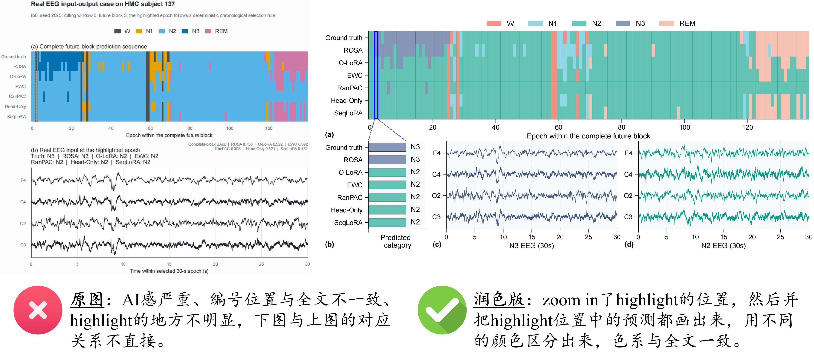
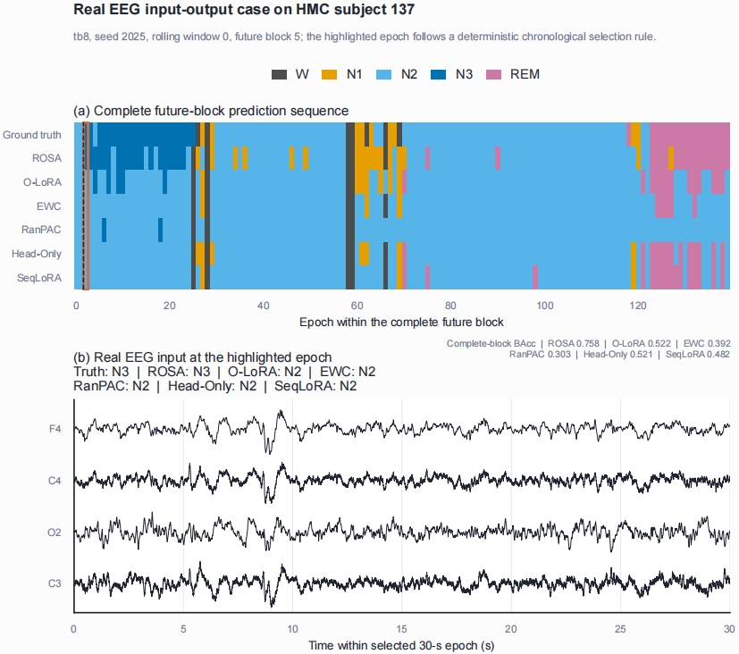
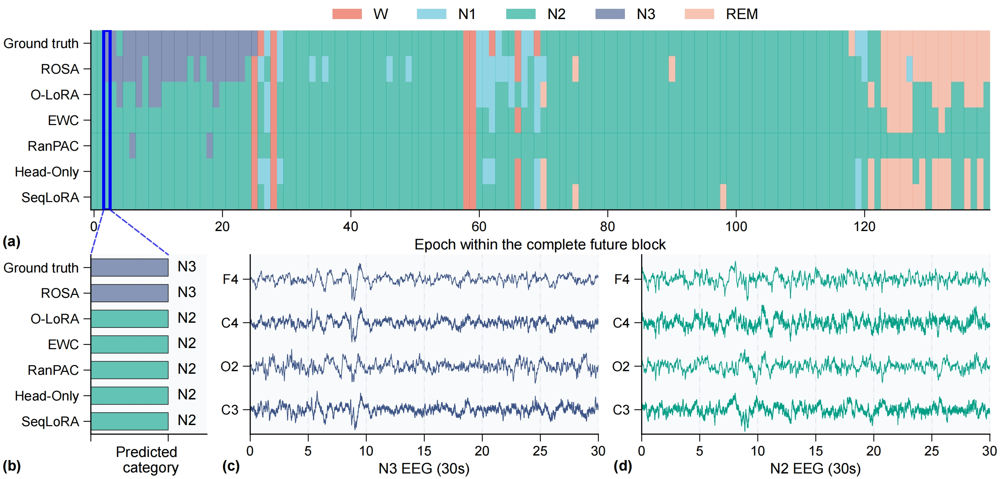

# 可视化案例图：从泛化展示到局部证据解释

对应类型：**可视化案例图**。

本案例讨论论文中的案例分析图。它通常用于展示某个具体样例中模型的输入、输出、预测差异和局部行为。它的任务不是简单放一张“看起来完整”的结果图，而是让读者看出某个样例为什么能支撑论文结论。

这类图最容易出现的问题是局部证据没有被真正讲清楚。原图虽然展示了完整序列和对应信号，但生成感明显，子图编号位置与全文不一致，高亮区域不够突出，下方信号图与上方预测序列之间的对应关系也不直接。

<figure markdown>
  

  <figcaption>图 1. 可视化案例图修改前后对比，修改后版本放大高亮位置，并把该位置中的预测结果和对应信号直接展开。</figcaption>
</figure>

## 文件说明

- [original.jpg](fig/original.jpg)：原始可视化案例图
- [revised.jpg](fig/revised.jpg)：修改后的可视化案例图
- [comparison.jpg](fig/comparison.jpg)：原图与修改后效果对比

## 案例背景

该图用于展示一个真实脑电样例中的输入输出关系。上方是完整未来片段中的预测序列，下方是某个被选中片段的脑电信号。图中希望表达的核心结论是：

```text
模型在完整序列中的预测存在差异；
被高亮的局部片段能够解释这些差异；
不同方法在同一位置上的预测类别不同。
```

因此，这张图的重点不应该只是展示整段序列，而是要让读者明确看到“高亮位置在哪里”“这个位置对应哪段信号”“各方法在该位置预测了什么”。

## 原图

<figure markdown>
  

  <figcaption>图 2. 原始可视化案例图，完整信息较多，但高亮区域和局部解释之间的对应关系不够直接。</figcaption>
</figure>

## 原图问题

### 1. 生成感明显

原图的整体排版、字体、颜色和局部标注显得比较松散，视觉上像是临时拼接出的展示图。对于论文中的案例分析图，这会降低读者对图件严谨性的判断。

修改时需要减少装饰感，统一字体、线宽、配色、编号和图例，使整张图更接近正式论文图，而不是汇报幻灯片或自动生成草图。

### 2. 编号位置与全文不一致

子图编号如果在不同论文图中位置不一致，读者会在阅读时产生额外负担。原图中的编号位置和全文其他图不统一，也没有很好地贴合对应子图的视觉边界。

修改时应让编号位置遵循全文规则，例如统一放在子图左上角或标题附近，并保持相同字号、粗细和间距。

### 3. 高亮位置不明显

原图中虽然标出了一个高亮位置，但它在完整序列中不够突出。读者很难第一时间判断这个位置为什么重要，也很难把它和下方信号图联系起来。

修改时应把高亮位置作为视觉锚点。可以用更清楚的边框、连接线、局部放大区域或统一颜色，使读者先看到高亮位置，再顺着视觉路径进入局部解释。

### 4. 上下图对应关系不直接

原图下方展示了对应脑电信号，但它和上方完整预测序列之间的关系不够直观。读者需要自己推断下方信号来自上方哪个位置，以及各方法在该位置的预测差异。

修改时应把上下关系显式画出来。高亮区域、局部放大图、预测类别和脑电信号应共享同一套颜色和连接规则。

## 修改后

<figure markdown>
  

  <figcaption>图 3. 修改后的可视化案例图，放大高亮位置，并把该位置中的真实标签、各方法预测和局部脑电信号展开。</figcaption>
</figure>

## 主要改进

1.  **放大高亮位置**  
    修改后对高亮位置进行局部放大，让读者直接看到该片段在完整序列中的位置和局部细节。

2.  **画出高亮位置中的预测结果**  
    修改后不只展示完整序列，还把高亮位置中的真实标签和不同方法预测都单独画出来。读者不需要回到正文或图注中查找各方法预测类别。

3.  **用不同颜色区分预测类别**  
    不同类别使用不同颜色表达，并且颜色与全文色系保持一致。这样既能突出预测差异，又不会让局部图看起来像另一套视觉系统。

4.  **增强上下图对应关系**  
    修改后通过放大框和连接关系，把上方完整序列、局部预测结果和下方脑电信号串起来。读者可以顺着图的结构理解该样例，而不是在多个区域之间来回寻找对应关系。

5.  **统一编号和格式**  
    修改后统一了子图编号位置、字体大小、线宽和留白，使案例图与全文其他图保持一致。

## 修改思路

这类案例分析图可以按下面的顺序重构：

1.  先确定案例图要解释的局部现象；
2.  在完整序列中明确标出对应位置；
3.  对高亮位置进行局部放大；
4.  在放大区域中画出真实标签和各方法预测；
5.  用全文一致的色系区分类别和方法；
6.  用连接线或视觉路径说明上下图对应关系；
7.  统一子图编号、字体、线宽和图例格式。

## 检查清单

画可视化案例图时，可以检查：

- [ ] 读者是否能一眼看出案例图想解释哪个局部现象？
- [ ] 高亮位置是否足够明显？
- [ ] 高亮位置是否和下方局部信号或样例直接对应？
- [ ] 是否把该位置中的真实标签和各方法预测都画出来？
- [ ] 不同类别或预测结果是否使用了清楚且一致的颜色？
- [ ] 色系是否与全文其他图保持一致？
- [ ] 子图编号位置是否与全文一致？
- [ ] 图内字体、线宽、图例和留白是否统一？
- [ ] 是否避免出现明显的临时拼接感或生成感？

## 经验总结

可视化案例图的价值在于解释局部现象，而不是展示一张完整但读不出重点的图。好的案例图应该把“完整上下文”和“关键局部”连接起来，让读者既知道现象发生在哪里，也能看清不同方法在该位置到底做出了什么预测。
