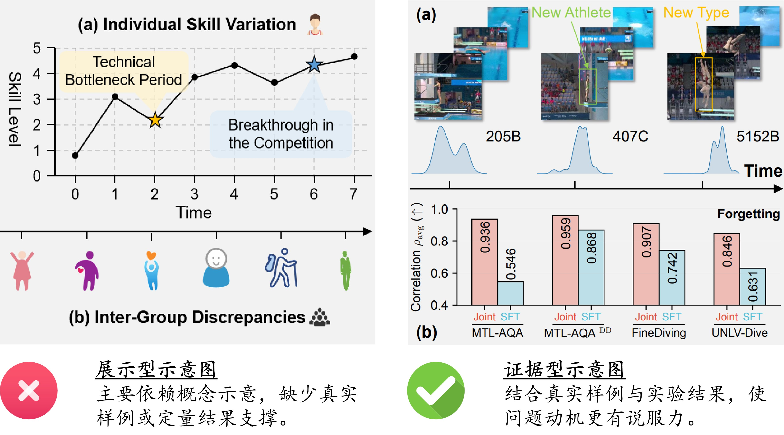

# 流程图和示意图：从展示型动机图到证据支撑

对应类型：**流程图和示意图**。

科研图不仅要“讲清楚”，还要“有证据”。很多动机示意图会使用概念曲线、图标、箭头和文字来解释研究问题，但如果缺少真实数据或实验结果支撑，就容易停留在展示型示意图，而不是能支撑论文判断的科研图。

<figure markdown>
  

  <figcaption>图 1. 展示型示意图与证据型科研图的对比，右侧版本用真实样例和定量结果支撑核心判断。</figcaption>
</figure>

## 文件说明

- [comparison.jpg](fig/comparison.jpg)：左侧为展示型示意图，右侧为证据型科研图

本案例重点不是讨论图是否“美观”，而是判断图中的核心判断是否有数据证据支撑。

## 案例背景

论文中的 motivation figure 常常承担一个关键任务：让读者相信研究问题真实存在，并且值得被解决。一个常见错误是只画概念曲线、抽象图标和方向性箭头，却没有放入真实样例、实验统计或定量对比。

这类图在报告中可能足够直观，但在论文中容易出现问题：

- 读者不知道现象是否来自真实数据；
- 曲线趋势没有实验来源；
- 图中结论无法被结果直接支撑；
- 图更像 illustration，而不是 argument。

## 反例：展示型示意图

左侧图试图说明个体技能变化和群体差异，但主要依赖手绘趋势、图标和概念性标注。虽然表达直观，但缺少真实样例、实验统计或定量结果，因此难以证明这些现象确实存在。

常见问题包括：

- 概念表达多，数据证据少；
- 曲线和标注缺少来源；
- 图中结论难以被实验结果直接支撑；
- 更适合作为报告插图，而不是论文中的核心论证图。

### 典型代码或绘图习惯

这类反例通常不是由某一行代码造成的，而是由绘图思路造成的。常见做法包括：

```text
抽象图标 + 手绘趋势线 + 箭头解释
```

问题在于：这些元素只表达作者的理解，并不能证明数据中确实存在对应现象。

## 正例：证据支撑型科研图

右侧图将真实视频样例与定量实验结果结合起来。上半部分展示真实数据中的挑战，例如新运动员和新动作类型；下半部分通过柱状图展示不同方法在多个数据集上的表现差异，并指出遗忘现象。

这种设计的优势在于：

- 用真实样例说明问题来源；
- 用定量结果支撑核心论点；
- 将数据挑战与实验现象联系起来；
- 更适合作为论文中的 motivation 或 analysis figure。

### 改进思路

将展示型示意图改成证据型科研图时，可以按下面的顺序重构：

1. 先放真实样例，让读者看到问题来自数据；
2. 再放定量结果，证明现象不是个别案例；
3. 用少量箭头或标注连接“问题来源”和“实验现象”；
4. 删除没有数据支撑的概念曲线；
5. 保留图注中的数据来源、指标定义和实验设置。

可以把绘图目标从：

```text
让读者理解我想表达什么
```

改成：

```text
让读者看到什么证据支持这个判断
```

## 经验总结

好的科研图不只是“看起来合理”，而是应该让读者相信：论文提出的问题真实存在，方法要解决的挑战有数据支撑，实验结论能够被图中的证据清楚支持。

## 检查清单

画 motivation figure 或 analysis figure 时，可以检查：

- [ ] 是否包含真实数据样例？
- [ ] 是否包含定量实验或统计结果？
- [ ] 是否避免只用手绘曲线表达结论？
- [ ] 图中的每个核心判断是否有证据支撑？
- [ ] 图是否能直接服务于论文的主要论点？
- [ ] 图注是否说明数据来源、指标和实验设置？
- [ ] 读者是否能从图中直接看到“问题存在”的证据？

## 可复用原则

- **概念图适合解释机制，证据图适合支撑论点。** 不要用前者替代后者。
- **motivation figure 也需要证据。** 如果它承担论文论证任务，就应该包含真实样例或定量结果。
- **箭头和曲线不是证据。** 它们只能组织信息，不能替代数据。
- **先证明现象，再解释现象。** 论文主图通常应优先服务于可验证的论证链。
