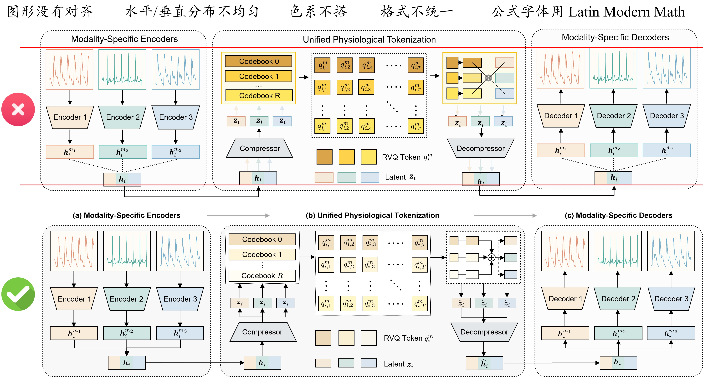
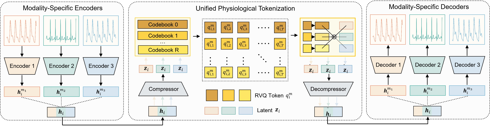
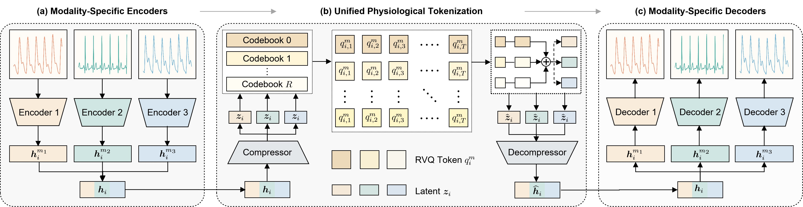

# 方法框架图：从拼贴式总览到统一结构

对应类型：**方法框架图**。

本案例讨论论文中的方法总览图。它通常用于展示方法整体结构、关键模块、输入输出关系和信息流。它的任务不是证明方法性能更强，而是让读者迅速理解方法由哪些部分组成，以及这些部分如何协同工作。

这类图最常见的问题不是“内容不够”，而是内容已经有了，但图形组织不够稳定：模块没有对齐，水平和垂直间距不均匀，色系不协调，格式规则不统一，公式字体也和正文风格脱节。

<figure markdown>
  

  <figcaption>图 1. 方法总览图修改前后对比，修改后版本统一了对齐、间距、配色和公式字体。</figcaption>
</figure>

## 文件说明

- [original.jpg](fig/original.jpg)：原始方法总览图
- [revised.jpg](fig/revised.jpg)：修改后的方法总览图
- [comparison.jpg](fig/comparison.jpg)：原图与修改后效果对比

## 案例背景

假设一张方法总览图包含输入数据、特征提取模块、核心模型、损失函数、检索或记忆模块，以及最终预测结果。图中还包含若干公式、箭头、图标和辅助说明。

这张图希望表达的核心结论是：

```text
本文方法由几个关键模块组成；
数据如何流过这些模块；
每个模块在整体框架中承担什么作用。
```

因此，图的重点应该落在结构关系和信息流上，而不是把所有实现细节都塞进主图。

## 原图

<figure markdown>
  

  <figcaption>图 2. 原始方法总览图，信息完整但模块对齐、空间分布、配色和公式字体不够统一。</figcaption>
</figure>

## 常见问题

### 1. 图形没有对齐

模块、图标、公式框和文字框如果没有落在同一组参考线上，读者会觉得图是临时拼出来的。最常见的问题是输入框、模型框和输出框上下边界不齐，箭头倾斜角度不一致，子模块之间看似相关却没有对齐关系。

修改时应先建立一个简单网格。主流程上的模块尽量共享同一条水平中心线；并列模块使用相同宽度或相同中心间距；上下分支用固定的垂直距离展开。

### 2. 水平和垂直分布不均匀

有些方法总览图左侧很空，右侧很挤；有些图上方堆满模块，下方只剩零散说明。这会让读者误以为拥挤区域更重要，也会让阅读路径变得不稳定。

修改时可以先把画布分成几个区域，例如输入区、主干模块区、辅助模块区和输出区。每个区域内部保持固定间距，区域之间用更大的留白区分层级。留白不是浪费空间，而是帮助读者识别结构。

### 3. 色系不搭

颜色如果只是从默认调色板中随意选取，很容易出现蓝、橙、紫、绿互相抢视觉重量的问题。更严重的是，同一颜色在图中没有稳定语义，例如有时表示数据，有时表示模块，有时又表示高亮。

修改时建议先确定颜色语义。比如主流程使用一组稳定主色，辅助模块使用低饱和灰蓝或浅灰，高亮模块只保留一种强调色。颜色数量不宜过多，同类模块应使用同一色系。

### 4. 格式不统一

圆角半径、边框粗细、箭头样式、阴影强度、图标风格和文字字号如果各不相同，读者会把注意力放在形式差异上，而不是方法结构上。

修改时应把图形元素整理成几类，并为每一类固定规则。例如所有主模块使用相同圆角和边框，所有辅助模块使用同一背景色，所有箭头使用相同线宽和箭头大小，所有说明文字使用同一字号层级。

### 5. 公式字体不一致

方法总览图中常会出现损失函数、特征表示或优化目标。公式如果直接从不同软件截图，或者使用和正文不同的数学字体，会显得像拼贴元素，也可能在缩放后变模糊。

如果图中包含公式，建议使用 `Latin Modern Math`，或使用与正文 LaTeX 公式一致的数学字体。公式应保持可编辑，尽量不要截图粘贴。普通文字和公式也应有清楚分工：普通标签使用无衬线字体，数学符号使用数学字体。具体安装和软件配置可参考[字体配置](../../environment/fonts/README.md)，尤其是其中的 Latin Modern Math 安装和 PowerPoint 公式字体设置。

## 修改后

<figure markdown>
  

  <figcaption>图 3. 修改后的方法总览图，通过统一网格、稳定色系和一致格式提升结构可读性。</figcaption>
</figure>

## 修改思路

方法总览图可以按下面的顺序重构：

1.  先确定主信息流，从输入到输出画出一条清楚路径；
2.  把模块放到统一网格上，先对齐再美化；
3.  固定模块间距，避免局部过挤或过空；
4.  为颜色建立语义，不让颜色只承担装饰功能；
5.  统一圆角、边框、线宽、箭头、阴影和字号；
6.  将公式改为 `Latin Modern Math` 或与正文一致的数学字体；
7.  删除无法帮助理解主流程的装饰元素。

## 检查清单

画方法总览图时，可以检查：

- [ ] 主流程是否从左到右或从上到下清楚展开？
- [ ] 所有模块是否在同一网格或参考线上对齐？
- [ ] 水平间距和垂直间距是否均匀？
- [ ] 主模块、辅助模块和输出结果是否有明确层级？
- [ ] 色系是否协调，颜色是否有固定语义？
- [ ] 同类模块是否使用相同形状、圆角、边框和背景色？
- [ ] 箭头线宽、箭头大小和连接位置是否统一？
- [ ] 图中文字字号和字体是否统一？
- [ ] 公式是否使用 `Latin Modern Math` 或与正文 LaTeX 一致的数学字体？
- [ ] 是否避免把公式、图标或文字截图后直接拼贴进图中？

## 经验总结

好的方法总览图应该像一张结构清楚的地图。读者先看到主流程，再看到关键模块，最后才查看局部细节。对齐、间距、配色和字体并不是表面美化，而是在帮助读者判断模块关系和信息流方向。
