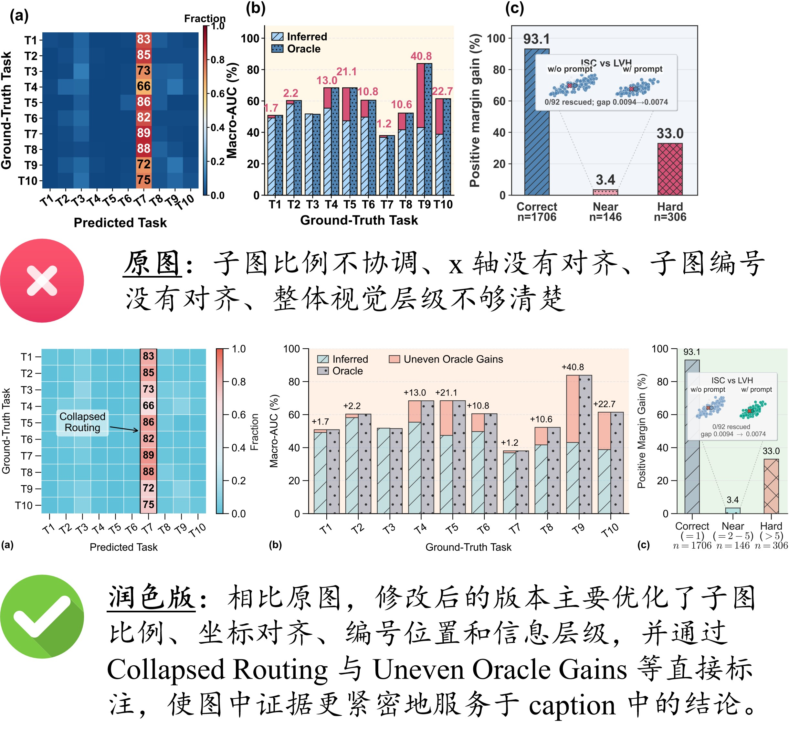
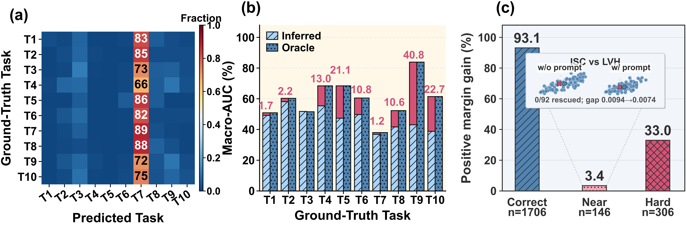
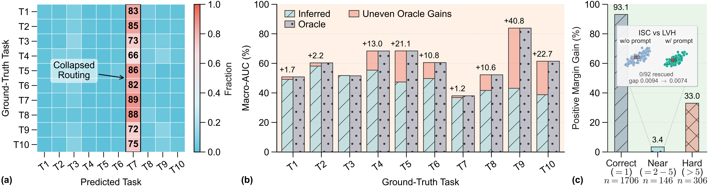

# 多子图证据链分析图

本案例展示如何优化一个多子图分析图，使其从“信息堆叠”转向“证据链清晰”的科研图表达。

多子图分析图常用于同时展示多个实验现象，例如分布、性能对比、消融结果和样本级分析。它的难点不只是把多个子图放在一起，而是让每个子图都服务于一个明确结论，并共同支撑论文中的核心论点。

<figure markdown>
  

  <figcaption>图 1. 多子图证据链分析图修改前后对比，修改后版本强化子图之间的论证关系。</figcaption>
</figure>

## 文件说明

- [original.py](code/original.py)：原始绘图代码，对应 [original.png](fig/original.png)
- [revised.py](code/revised.py)：修改后的绘图代码，对应 [revision.png](fig/revision.png)
- [comparison.jpg](fig/comparison.jpg)：原图与修改后效果对比

建议阅读顺序是先看 `fig/comparison.jpg`，再对照 `code/original.py` 和 `code/revised.py` 理解具体修改。

## 案例背景

该图用于分析 **prompt-based conditioning 在严格顺序 ECG 学习中的局限性**。

图中包含三个子图：

- **(a)** final routing confusion：展示最终 routing 的混淆情况；
- **(b)** inferred routing vs. oracle routing：比较不同 routing 设置下的 Macro-AUC；
- **(c)** positive margin gain：分析不同样本难度下 prompt 带来的 margin gain。

该图希望表达的核心结论是：

```text
Routing collapse → Uneven oracle gains → Few near-miss rescues
```

也就是说，prompt-based conditioning 的问题不仅在于 routing error，还在于即使给定 oracle routing，性能提升仍然有限且不均匀；同时，prompt gain 主要发生在 already-correct samples 上，而 near-miss cases 很少被真正 rescue。

## 原图

<figure markdown>
  

  <figcaption>图 2. 原始多子图分析图，包含较完整的数据证据，但布局和重点提示不够集中。</figcaption>
</figure>

### 原图问题

原图已经包含较完整的实验信息，但版式和信息组织仍不够清晰。

主要问题包括：

1.  **子图比例不协调**  
    `(a)`、`(b)`、`(c)` 的宽度、高度和视觉重量不够统一，整体排版略显松散。
    
2.  **局部信息拥挤**  
    `(b)` 中同时包含两组柱子、纹理、提升数值和图例；`(c)` 中还包含 inset，导致局部信息密度较高。
    
3.  **x 轴没有对齐**  
    三个子图的底部标签和坐标轴基线不统一，影响 multi-panel figure 的整体规范性。
    
4.  **子图编号没有对齐**  
    `(a)`、`(b)`、`(c)` 的位置不统一，使整张图看起来不够整齐。
    
5.  **核心结论不够直接**  
    例如 `(a)` 中 T7 列明显突出，但图中没有直接说明这是 routing collapse；读者需要自己从数据中推断结论。
    

简而言之：

> 原图的问题不是“没有数据”，而是“有数据但没有把证据链组织得足够清楚”。

---

## 修改后

<figure markdown>
  

  <figcaption>图 3. 修改后的多子图分析图，通过统一布局、对齐编号和补充关键标注强化证据链。</figcaption>
</figure>

### 主要改进

相对于原图，修改后的版本主要做了以下改进：

1.  **统一子图版式**  
    重新调整 `(a)`、`(b)`、`(c)` 的比例与高度，使三个子图在同一水平线上展开，整体更协调。
    
2.  **对齐坐标轴与子图编号**  
    修正原图中 x 轴、底部标签和 `(a)(b)(c)` 编号不对齐的问题，增强 multi-panel figure 的规范性。
    
3.  **强化图中结论提示**  
    在 `(a)` 中加入 “Collapsed Routing” 标注，并用箭头指向集中的 task branch，使 routing collapse 现象更加直观。
    
4.  **让 `(b)` 的对比关系更清楚**  
    将 improvement 解释为 “Uneven Oracle Gains”，并用 `+x.x` 标注不同任务上的提升幅度，使 oracle routing 的不均匀收益更加明显。
    
5.  **保留 `(c)` 的关键分组信息**  
    在 Correct、Near、Hard 三组中保留 rank 定义和样本数量，直接对应图注中关于 near-miss cases rarely rescued 的结论。
    
6.  **减少视觉干扰**  
    统一配色、背景和纹理，使图从“结果堆叠”转向“证据链表达”。
    
## 代码层面的修改

本案例的修改不是简单调整字号或颜色，而是把 multi-panel figure 的代码从“逐个子图拼接”改成“围绕证据链组织布局”。核心变化可以概括为：

```text
固定画布与子图比例
→ 用独立 GridSpec 控制 colorbar 和主图
→ 用 figure 坐标统一 panel label
→ 在图内直接标出关键现象
→ 用低饱和、半透明配色降低干扰
```

### 1. 重新定义画布比例和 GridSpec

原始代码使用 3 列布局，三个 panel 的宽度比较接近：

```python
fig = plt.figure(figsize=(args.fig_width, args.fig_height), facecolor="white")
outer = fig.add_gridspec(
    1,
    3,
    width_ratios=[2.30, 2.65, 2.60],
    left=0.058,
    right=0.992,
    bottom=0.255,
    top=0.895,
    wspace=0.320,
)

draw_confusion_panel(fig, outer[0])
draw_oracle_panel(fig, outer[1])
draw_margin_panel(fig, outer[2])
```

修改后改为更宽的横向画布，并把 colorbar 从 panel (a) 中拆出来，作为独立列管理：

```python
fig = plt.figure(figsize=(args.fig_width, args.fig_height), facecolor="white")
outer = fig.add_gridspec(
    1,
    4,
    width_ratios=[3, 0.10, 5.8, 2],
    wspace=0.32,
)

draw_confusion_panel(fig, outer[0], outer[1])
draw_oracle_panel(fig, outer[2])
draw_margin_panel(fig, outer[3])
```

这样做的好处是：

- panel (a) 的热力图可以保持正方形，不被 colorbar 挤压；
- panel (b) 承担主要性能对比，因此获得更大的横向空间；
- panel (c) 作为样本级解释，宽度更紧凑；
- 三个 panel 的视觉权重更接近论文中的论证顺序。

### 2. 把配色改成半透明的 Nature 风格 palette

原始代码直接使用实色：

```python
INFERRED_BAR_COLOR = "#AAD4F8"
ORACLE_BAR_COLOR = "#5184B2"
BAR_GAIN_COLOR = "#D55276"
BACKGROUND_COLOR = "#C9D1D9"
PAIR_COLORS = {"A": "#5184B2", "B": "#D55276"}
```

修改后引入 `to_rgba`，用透明度降低颜色压迫感，同时让不同 panel 的颜色语义保持一致：

```python
from matplotlib.colors import to_rgba

INFERRED_BAR_COLOR = to_rgba("#4DBBD5", alpha=0.32)
ORACLE_BAR_COLOR = to_rgba("#3C5488", alpha=0.32)
BAR_GAIN_COLOR = to_rgba("#E64B35", alpha=0.32)
BACKGROUND_COLOR = to_rgba("#D0D0D0", alpha=0.32)

PAIR_COLORS = {
    "A": to_rgba("#3C5488", alpha=0.32),
    "B": to_rgba("#E64B35", alpha=0.32),
}
```

修改后的配色接近 Nature Publishing Group / `ggsci::npg` 常用的科研图 palette，但没有直接使用高饱和实色，而是通过 alpha 降低视觉重量：

| 语义 | 颜色 | 用途 |
| --- | --- | --- |
| cyan blue | `#4DBBD5`, alpha `0.32` | inferred bar、margin 中间组、热力图低值端 |
| dark blue | `#3C5488`, alpha `0.32` | oracle bar、类别 A、主要基准信息 |
| vermilion red | `#E64B35`, alpha `0.32` | oracle gain、类别 B、风险或差异信息 |
| green | `#00A087`, alpha `0.60` | prompt condition 下的类别 A |
| neutral gray | `#D0D0D0`, alpha `0.32` | 背景样本点 |
| dark text gray | `#1A1A1A` | 正文、坐标轴文字 |
| light grid gray | `#E5E5E5` / `#E6E6E6` | 网格线和辅助线 |

这类修改适合多子图分析图：颜色不只负责“好看”，还负责建立跨 panel 的语义一致性。例如蓝色表示 inferred/oracle 相关信息，红色表示 gap、gain 或风险信号。半透明填充还能让柱子、散点、hatch 和文字标注同时存在时不至于互相抢视觉焦点。

### 3. 统一字号和加粗系统

原始代码的字号和加粗系统比较混乱：一方面定义了很多局部字号变量，例如 `AXIS_LABEL_FONTSIZE = 15.0`、`TICK_LABEL_FONTSIZE = 13.0`、`LEGEND_FONTSIZE = 12.2`、`GAP_LABEL_FONTSIZE = 12.5`、`PANEL_C_VALUE_FONTSIZE = 16.0`；另一方面又在 `rcParams` 中把全局字体、坐标轴标题和刻度全部设成 bold。

```python
plt.rcParams.update(
    {
        "font.family": "sans-serif",
        "font.weight": "bold",
        "axes.labelsize": AXIS_LABEL_FONTSIZE,
        "axes.titlesize": AXIS_LABEL_FONTSIZE,
        "axes.labelweight": "bold",
        "axes.titleweight": "bold",
        "xtick.labelsize": TICK_LABEL_FONTSIZE,
        "ytick.labelsize": TICK_LABEL_FONTSIZE,
        "legend.fontsize": LEGEND_FONTSIZE,
    }
)
```

这种写法的问题是：所有文字都被加粗后，真正重要的信息反而不突出；同时不同 panel 又各自使用不同字号，导致图例、坐标轴、数值标注和 inset 文字的层级不稳定。

修改后改成更克制的字体系统：全局基准字号统一为 `14`，默认不加粗，只保留 panel label 这类结构性标识的 bold。

```python
plt.rcParams.update(
    {
        "font.family": "Arial",
        "font.sans-serif": ["Arial", "Helvetica", "DejaVu Sans"],
        "mathtext.fontset": "cm",
        "font.size": 14,
        "axes.labelsize": 14,
        "axes.titlesize": 14,
        "xtick.labelsize": 14,
        "ytick.labelsize": 14,
        "legend.fontsize": 14,
        "xtick.direction": "out",
        "ytick.direction": "out",
        "xtick.major.size": 8,
        "ytick.major.size": 8,
        "xtick.major.width": 1,
        "ytick.major.width": 1,
    }
)
```

具体改法是：

- **普通信息不加粗。** 坐标轴、tick label、legend 和数值标注使用 regular weight。
- **结构信息才加粗。** 只保留 `(a)(b)(c)` 这类 panel label 的 `fontweight="bold"`。
- **主图字号统一。** 坐标轴、刻度和图例统一到 14 pt，避免每个 panel 像来自不同模板。
- **inset 字号单独降级。** inset title、subtitle、summary 保持较小字号，因为它们是解释层，不应压过主图。
- **数学标注用 mathtext。** 例如 `($=1$)`、`$n=1706$` 使用 `mathtext.fontset = "cm"`，让 tick label 中的数学部分更稳定。

这个调整的原则是：字号负责建立信息层级，加粗只用于结构锚点，不应该用 bold 弥补布局或标注不清的问题。

### 4. 用 figure 坐标统一 panel label

原始代码把 `(a)(b)(c)` 写在各自 axes 的相对坐标里：

```python
def draw_panel_label(ax, label: str, x: float, y: float = 1.055) -> None:
    ax.text(
        x,
        y,
        label,
        transform=ax.transAxes,
        ha="left",
        va="bottom",
        fontsize=PANEL_LABEL_FONTSIZE,
        fontweight="bold",
        clip_on=False,
    )
```

这种写法在单图中通常没问题，但 multi-panel figure 中不同 panel 的 aspect ratio、inset、colorbar 都可能不同，label 容易看起来不对齐。

修改后改为获取每个 panel 所在的最外层 `SubplotSpec`，再用 `fig.text` 写在 figure 坐标系统中：

```python
def draw_panel_label(ax, label: str, x: float = -12.0, y: float = -12.0) -> None:
    from matplotlib.transforms import offset_copy

    fig = ax.figure
    top_spec = ax.get_subplotspec().get_topmost_subplotspec()
    bbox = top_spec.get_position(fig)
    text_transform = offset_copy(fig.transFigure, fig=fig, x=x, y=y, units="points")

    fig.text(
        bbox.x0 - 0.032,
        bbox.y0 - 0.13,
        label,
        transform=text_transform,
        ha="left",
        va="bottom",
        fontsize=14,
        fontweight="bold",
    )
```

这个技巧适合所有复杂 panel 图：当子图内部结构不同的时候，编号应该跟随外层版式，而不是跟随某一个 axes。

### 5. Panel (a)：从热力图数值改成结论标注

原始版本使用 `imshow`，并只在 T7 列显示数值。读者能看到 T7 明显偏高，但还需要自己推断这是 routing collapse。

修改后主要做了三件事：

- 用 `pcolormesh` 明确单元格边界；
- 用 `Rectangle` 框出被集中路由的 T7 列；
- 直接添加 “Collapsed Routing” annotation。

```python
im = ax.pcolormesh(
    x_edges,
    y_edges,
    final_confusion,
    cmap=cmap,
    vmin=0.0,
    vmax=1.0,
    shading="flat",
    edgecolors="#FFFFFF",
    linewidth=0.6,
)
ax.set_ylim(num_tasks, 0)
ax.set_box_aspect(1)

collapse_rect = Rectangle(
    (highlight_col, 0),
    1,
    num_tasks,
    fill=False,
    linewidth=1.2,
    linestyle="-",
    zorder=6,
)
ax.add_patch(collapse_rect)

ax.annotate(
    "Collapsed\nRouting",
    xy=(highlight_col, num_tasks * 0.50),
    xycoords="data",
    xytext=(0.25, 0.50),
    textcoords=ax.transAxes,
    bbox=dict(boxstyle="round,pad=0.3", facecolor="white", edgecolor="none", alpha=0.6),
    arrowprops=dict(arrowstyle="->", lw=1.2),
    zorder=7,
)
```

这里的关键不是多加一个箭头，而是把 panel (a) 的阅读任务从“观察矩阵”改成“识别失败模式”。

### 6. Panel (b)：把 oracle gap 改成可读的 gain 证据

原始版本已经画出 inferred、oracle 和二者差值，但图例顺序、数值标注和 y 轴范围会让读者分散注意力。

修改后把 gap 显式命名为 `Uneven Oracle Gains`，并把数值标成 `+x.x`：

```python
ax.bar(
    x_positions - width / 2,
    gap_to_oracle,
    width=width,
    bottom=infer_final,
    label="Uneven Oracle Gains",
    color=BAR_GAIN_COLOR,
    edgecolor=BAR_EDGE_COLOR,
    linewidth=0.95,
    zorder=4,
)

for task_id, x_pos, infer_val, gap_val in zip(
    task_ids, x_positions - width / 2, infer_final, gap_to_oracle
):
    if gap_val <= 0.05:
        continue
    ax.text(
        x_pos,
        infer_val + gap_val + 2,
        f"+{gap_val:.1f}",
        ha="center",
        va="bottom",
        fontsize=12,
        zorder=6,
    )
```

图例也改为手动排序，保证读者先看到基础对比，再看到结论性 gap：

```python
handles, labels = ax.get_legend_handles_labels()
label_to_handle = {label: handle for handle, label in zip(handles, labels)}
ordered_labels = ["Inferred", "Oracle", "Uneven Oracle Gains"]
ordered_handles = [
    label_to_handle[label]
    for label in ordered_labels
    if label in label_to_handle
]

ax.legend(ordered_handles, ordered_labels, frameon=False, ncol=2)
```

这一步把 panel (b) 从“性能柱状图”推进为“oracle 上界也不均匀”的证据。

### 7. Panel (c)：保留样本分组，同时把 inset 变成解释证据

Panel (c) 的重点是说明 prompt gain 并不主要来自 near-miss rescue。修改后保留 Correct、Near、Hard 三组，同时把 rank 定义和样本量直接放进 x tick：

```python
xtick_labels = [
    "Correct\n($=1$)\n$n=1706$",
    "Near\n($=2-5$)\n$n=146$",
    "Hard\n($>5$)\n$n=306$",
]
ax.set_xticklabels(xtick_labels, ha="right")
```

inset 的 `w/o prompt` 和 `w/ prompt` 使用不同 condition colors，避免读者把两个小散点图看成重复信息：

```python
INSET_CONDITION_COLORS = {
    "noprompt": {
        "A": to_rgba("#7EA3C9", alpha=0.45),
        "B": to_rgba("#C76D5E", alpha=0.45),
        "A_center": "#7EA3C9",
        "B_center": "#C76D5E",
    },
    "prompt": {
        "A": to_rgba("#00A087", alpha=0.60),
        "B": to_rgba("#E64B35", alpha=0.60),
        "A_center": "#00A087",
        "B_center": "#E64B35",
    },
}
```

同时保留一句直接解释 inset 的文字：

```python
ax.text(
    inset_x + inset_w / 2.0,
    inset_y + 0.01,
    "0/92 rescued \n gap 0.0094 $\\rightarrow$ 0.0074",
    transform=ax.transAxes,
    ha="center",
    va="bottom",
    fontsize=INSET_SUMMARY_FONTSIZE,
    color="#4F4F4F",
    zorder=7,
)
```

这类 inset 不应该只是“补充装饰”，而应该回答一个明确问题：near-miss 样本到底有没有被 prompt rescue？

### 8. 增加数据读取的健壮性

修改后在读取二维投影坐标时加入了缺失值和类型检查：

```python
proj_x_raw = raw.get("proj_x")
proj_y_raw = raw.get("proj_y")
if proj_x_raw is None or proj_y_raw is None:
    continue

try:
    proj_x = float(proj_x_raw)
    proj_y = float(proj_y_raw)
except (TypeError, ValueError):
    continue
```

科研绘图脚本经常会被反复复用。对输入数据做最小健壮性检查，可以避免因为一行异常数据导致整张图无法导出。

## 可复用原则

这个案例可以抽象成 5 条可复用规则：

- **先确定证据链，再决定 panel 顺序。** 本例是 routing collapse → uneven oracle gains → few near-miss rescues。
- **复杂布局用外层 GridSpec 管理。** colorbar、inset、主图比例都应显式控制。
- **panel label 跟随版式，不跟随局部 axes。** 多子图中优先使用 figure 坐标。
- **图内标注要指出现象名称。** 不要只让读者看到数值，还要帮助读者识别失败模式。
- **代码中的颜色、字号、间距应参数化。** 多 panel 图最怕局部手调导致整体风格漂移。
