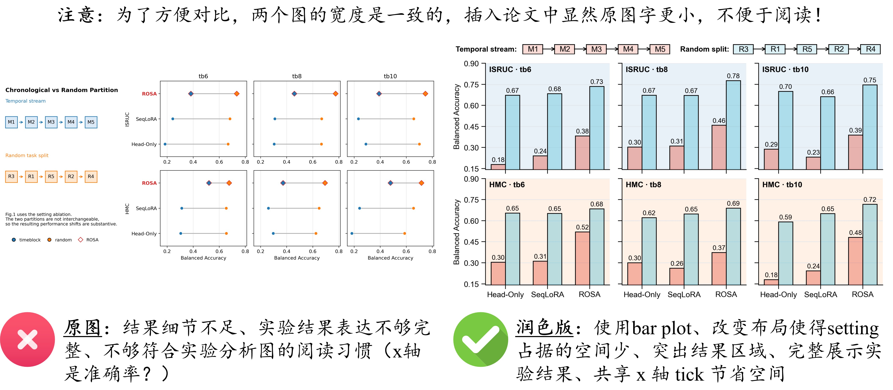
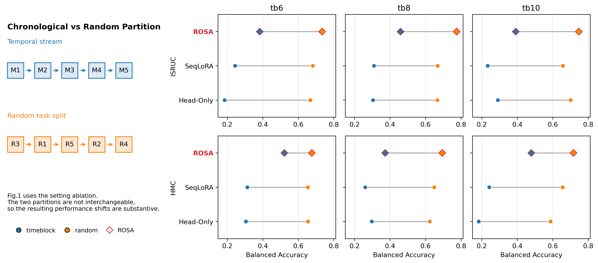
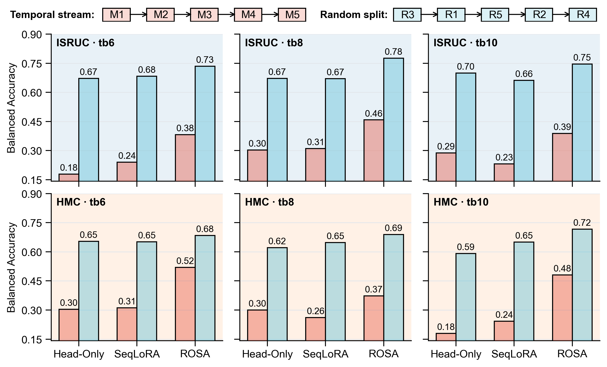

# 设置消融图：让实验划分差异变成可读结果

本案例展示如何优化一个 setting ablation figure，使其从“示意图加点线对比”转向“直接展示实验结果差异”的科研图表达。

设置消融图常用于说明不同数据划分、训练协议或评估设定会带来怎样的性能变化。它的核心任务不是只告诉读者“两个 setting 不一样”，而是让读者看到：**这种 setting 差异是否真实影响了实验结论。**



## 文件说明

- [original.png](fig/original.png)：原始设置消融图
- [revised.py](code/revised.py)：修改后的绘图代码，对应 [revised.png](fig/revised.png)
- [revised.png](fig/revised.png)：修改后的设置消融图
- [comparison.jpg](fig/comparison.jpg)：原图与修改后效果对比

本案例重点不是讨论 random split 或 temporal stream 哪个更合理，而是讨论如何把 setting ablation 的结果画得更清楚、更适合论文阅读。

## 案例背景

该图用于比较两种数据划分方式下的模型表现：

- **temporal stream / timeblock**：按时间顺序划分，保留真实时间结构；
- **random task split**：打乱任务或 block 顺序，形成随机划分；
- **Balanced Accuracy**：用于比较不同方法在不同划分方式下的性能。

图中涉及两个数据集 `ISRUC` 和 `HMC`，三个 time block 设置 `tb6`、`tb8`、`tb10`，以及三种方法 `Head-Only`、`SeqLoRA` 和 `ROSA`。

这张图希望表达的核心结论是：

```text
temporal partition 和 random split 不是可以互换的设置；
不同划分方式会带来显著的性能差异。
```

因此，图的重点应该落在每个数据集、每个 time block、每个方法下的具体结果，而不是只展示两个 partition 的概念差异。

## 原图



### 原图问题

原图已经包含 temporal stream 与 random task split 的示意，也展示了不同方法的性能变化，但作为实验结果图仍有几个问题：

1.  **结果细节不足**  
    点线图可以看出两个 setting 之间存在差异，但具体数值不够直接。读者很难快速比较每个方法在不同数据集和 time block 下的实际表现。

2.  **示意部分占比偏大**  
    左侧 partition schematic 占据较多空间，但真正支撑结论的是右侧实验结果。对于 ablation figure 来说，示意图不应压过结果图。

3.  **读图路径不够自然**  
    读者需要先理解 temporal / random 的符号，再跨多个小图比较点的位置和连线长度，阅读负担较高。

4.  **方法和 setting 的关系不够直观**  
    点线连接强调同一方法在两个 partition 下的差异，但不利于横向比较 `Head-Only`、`SeqLoRA` 和 `ROSA` 的绝对表现。

5.  **不够像论文中的结果分析图**  
    原图更像“设置解释 + 结果草图”，而不是完整的实验结果展示。它能表达方向，但不够方便读者审查数据。

简而言之：

> 原图的问题不是“没有结果”，而是“结果没有被放在最容易比较和验证的位置”。

## 修改后



### 主要改进

相对于原图，修改后的版本主要做了以下改进：

1.  **改用 bar plot 展示结果**  
    每个方法下直接并排展示 timeblock 与 random split 的 Balanced Accuracy，读者可以立即比较两种 setting 的数值差异。

2.  **用分面布局组织变量**  
    行表示数据集，列表示 `tb6`、`tb8`、`tb10`。这种布局让 dataset、time block 和 method 三个维度各有固定位置，阅读路径更稳定。

3.  **保留最小必要示意**  
    顶部只保留 temporal stream 与 random split 的简化 block 顺序，帮助读者理解颜色含义，但不再让示意图占据主要空间。

4.  **突出结果区域**  
    六个结果 panel 成为视觉主体，每个柱子上直接标注数值，方便读者检查具体实验结果。

5.  **统一坐标轴和视觉规则**  
    所有 panel 共享 y 轴范围，避免不同子图尺度不一致造成误读。网格、背景色和边框也被统一控制。

6.  **减少 x 轴拥挤**  
    方法名只在底部行显示，上方行隐藏重复 x tick label，使整体布局更干净。

## 代码层面的修改

本案例的修改重点是把“点线差异图”改成“分面柱状结果图”。核心变化可以概括为：

```text
设置示意压缩到顶部
→ dataset × time block 分面
→ 每个方法并排展示两种 partition
→ 统一 y 轴范围
→ 直接标注数值
```

### 1. 用固定顺序组织实验变量

修改后的代码显式定义数据集、time block 和方法顺序：

```python
FIG1_DATASET_ORDER = ["ISRUC", "HMC"]
TB_ORDER = ["tb6", "tb8", "tb10"]
FIG1_METHOD_ORDER = ["head_only", "seq_lora", "ROSA"]
```

这种写法可以避免绘图顺序受原始数据表顺序影响，也让 figure layout 与论文叙述保持一致。

### 2. 使用 GridSpec 构建顶部示意和结果分面

修改后的图采用 `3 × 3` 布局：第一行放简化 schematic，下面两行放六个结果 panel。

```python
gs = fig.add_gridspec(
    3,
    3,
    height_ratios=[0.1, 1.0, 1.0],
    left=0.055,
    right=0.992,
    top=0.94,
    bottom=0.11,
    wspace=0.1,
    hspace=0.12,
)
```

这样做的好处是：示意图只作为图例式说明存在，主要空间留给实验结果。

### 3. 用并排柱子直接比较两个 setting

每个方法下绘制两根柱子，分别对应 timeblock 和 random split：

```python
ax.bar(
    m_i - width / 2,
    t,
    width=width,
    color=to_rgba(COLORS["timeblock"], 0.38),
    edgecolor="#000000",
    linewidth=1.0,
)
ax.bar(
    m_i + width / 2,
    q,
    width=width,
    color=to_rgba(COLORS["random"], 0.38),
    edgecolor="#000000",
    linewidth=1.0,
)
```

相比原图中的水平连线，并排柱子更适合表达“两个 setting 下的实际结果是多少”，尤其适合需要读者检查数值大小的 ablation figure。

### 4. 统一 y 轴范围和数值标注

修改后的代码先收集全部结果，再统一计算 y 轴范围：

```python
all_vals = []
for r in FIG1_ROWS:
    all_vals.extend([r["timeblock_mean"], r["random_mean"]])
y_min, y_max = axis_limits(all_vals)
```

每个柱子上方直接标出两位小数：

```python
ax.text(
    m_i - width / 2,
    t + 0.01,
    f"{t:.2f}",
    ha="center",
    va="bottom",
)
```

这让读者不需要依赖估读坐标轴即可比较结果，也更适合展示 setting ablation 的具体差异。

## 经验总结

设置消融图的关键不是把 setting 画得很完整，而是让读者看到 setting 的改变是否会改变实验结论。示意图可以帮助理解实验设计，但不能替代结果展示。

当图的论点是“两个实验设置不可互换”时，最重要的信息通常是每个方法、每个数据集、每个设置下的具体性能。图的布局应该优先服务于这些比较。

## 检查清单

画 setting ablation figure 或 protocol comparison figure 时，可以检查：

- [ ] 图是否清楚说明比较的是哪两个 setting？
- [ ] 是否展示了每个 setting 下的具体实验结果？
- [ ] 是否避免让示意图占据过多空间？
- [ ] 多个数据集或 time block 是否用稳定的分面结构组织？
- [ ] 不同子图是否共享可比较的坐标轴范围？
- [ ] 颜色是否稳定对应同一种 setting？
- [ ] 数值标注是否帮助读者快速检查结果？
- [ ] 图是否能直接支持“setting 改变会影响结论”的判断？

## 可复用原则

- **setting ablation 不是只画 setting。** 如果结论来自性能变化，结果图应该是主体。
- **示意图负责解释变量，结果图负责支撑论点。** 两者不要抢视觉重心。
- **分面布局适合多维实验。** dataset、time block 和 method 应该各有稳定位置。
- **共享坐标轴范围能减少误读。** 尤其是跨数据集或跨设置比较时。
- **当读者需要比较具体数值时，bar plot 往往比点线草图更直接。**
