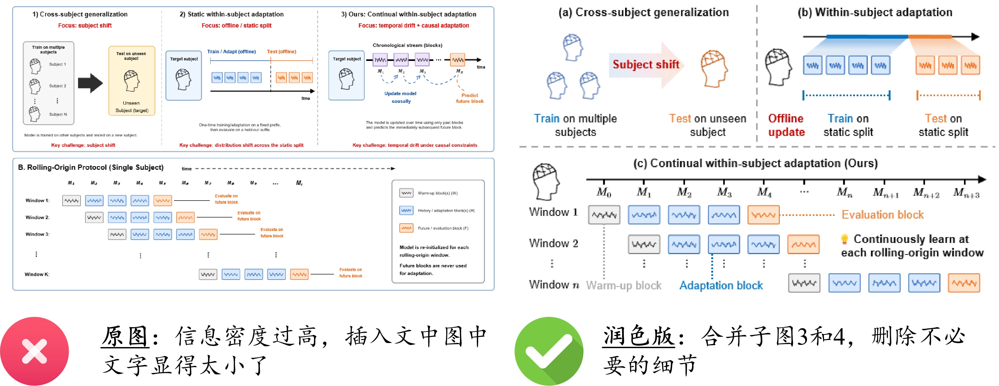
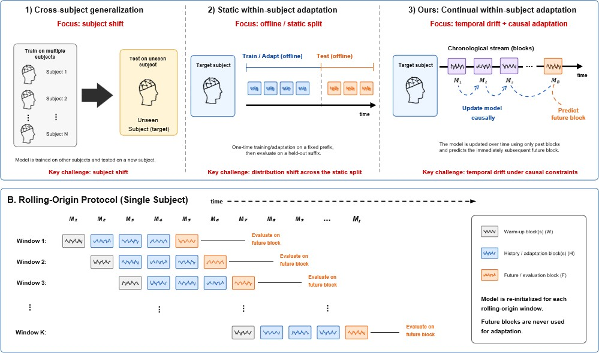
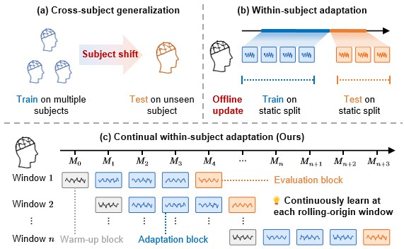

# 流程图和示意图：从完整任务流程到核心协议表达

对应类型：**流程图和示意图**。

本案例展示如何优化一个用于论文中的任务设定图，使其从“大而全的流程说明图”转向“读者能快速理解核心实验设定”的科研图表达。

任务设定图常用于解释训练、适应、测试、时间顺序和数据划分方式。它不一定包含实验结果，但必须清楚回答一个问题：**论文到底在什么设定下解决什么问题？**

<figure markdown>
  

  <figcaption>图 1. 任务设定图修改前后对比，修改后版本突出核心协议和时间顺序。</figcaption>
</figure>

## 文件说明

- [original.jpg](fig/original.jpg)：原始 protocol figure
- [revised.jpg](fig/revised.jpg)：修改后的 protocol figure
- [comparison.jpg](fig/comparison.jpg)：原图与修改后效果对比

本案例重点不是讨论图中协议是否正确，而是讨论如何把复杂实验设定组织成更清晰、更适合论文主文的示意图。

## 案例背景

该图用于说明一个面向单被试连续适应的实验设定。图中涉及三类常见设定：

- **cross-subject generalization**：在多个被试上训练，在未见过的目标被试上测试；
- **within-subject adaptation**：在目标被试的一段静态划分数据上适应，再在后续数据上测试；
- **continual within-subject adaptation**：按时间顺序滚动更新模型，并预测未来 block。

论文真正想强调的设定是第三类：

```text
目标被试数据按时间到达
→ 只能使用过去 block 更新模型
→ 在每个 rolling-origin window 上预测未来 block
```

因此，这张图的主要任务不是完整枚举所有细节，而是让读者迅速看懂 proposed setting 与常规设定的差异。

## 原图

<figure markdown>
  

  <figcaption>图 2. 原始任务设定图，信息完整但层级较多，核心设定不够突出。</figcaption>
</figure>

### 原图问题

原图包含较完整的信息，但作为论文主图时显得过重，主要问题包括：

1.  **信息层级过多**  
    图中同时展示 cross-subject、static within-subject、continual adaptation 和 rolling-origin protocol。每一部分又包含大量说明文字，读者需要花较长时间才能判断重点。

2.  **主次关系不够明确**  
    第三种 continual within-subject adaptation 才是论文方法关注的核心，但它和前两种 baseline setting 在视觉重量上接近，重点没有被充分突出。

3.  **文字说明偏多**  
    图中出现多处完整句子，例如模型如何更新、未来 block 是否用于 adaptation 等。这些内容更适合放在 caption 或正文中，而不是全部压进图内。

4.  **局部布局拥挤**  
    上半部分被三列切开，下半部分又单独展开 rolling-origin protocol。图的信息很完整，但横向和纵向阅读路径都较长。

5.  **符号系统不够集中**  
    warm-up block、history / adaptation block、future / evaluation block 的含义在图中出现较晚，读者需要先理解多个 panel，才能回到协议主线。

简而言之：

> 原图的问题不是“没有讲清楚”，而是“讲得太完整，导致论文主图中的核心设定被稀释”。

## 修改后

<figure markdown>
  

  <figcaption>图 3. 修改后的任务设定图，保留核心对比并强化连续适应设定。</figcaption>
</figure>

### 主要改进

相对于原图，修改后的版本主要做了以下改进：

1.  **保留核心对比，删除次要解释**  
    修改后只保留 `(a)` cross-subject generalization、`(b)` within-subject adaptation 和 `(c)` continual within-subject adaptation 三个核心设定，不再展开完整的大幅 rolling-origin protocol。

2.  **突出 proposed setting**  
    `(c)` 被放在下方独立横向区域，并占据更大的视觉空间，使读者自然把注意力放到 continual within-subject adaptation 上。

3.  **统一 block 语义**  
    使用灰色表示 warm-up block，蓝色表示 adaptation block，橙色表示 evaluation block。颜色语义贯穿整个图，降低读者理解成本。

4.  **减少图内文字**  
    原图中的长句说明被压缩为短标签，例如 `Offline update`、`Train on static split`、`Test on static split` 和 `Continuously learn at each rolling-origin window`。

5.  **强化时间顺序**  
    `(c)` 中用一条水平时间轴串起 `M_0, M_1, ..., M_n`，并通过多行 window 表达滚动起点，使 causal / temporal setting 更直观。

6.  **让 baseline 与 ours 的差异更直接**  
    `(a)` 强调 subject shift，`(b)` 强调 static split 下的 offline update，`(c)` 强调 continuous update 与 future evaluation。三者形成清楚的对比关系。

## 修改思路

这类 protocol figure 的优化重点不是增加视觉装饰，而是重新选择信息粒度。可以把绘图目标从：

```text
把所有实验流程都画出来
```

改成：

```text
让读者快速理解本文实验设定和已有设定的关键区别
```

具体可以按下面的顺序重构：

1.  先确定图要支撑的核心结论；
2.  保留能区分不同 setting 的最小必要元素；
3.  将颜色绑定到稳定语义，而不是绑定到局部装饰；
4.  把长句说明移到 caption 或正文；
5.  用 panel layout 表达主次关系；
6.  让时间轴、训练段、适应段和测试段在视觉上形成一致规则。

## 经验总结

任务设定图的价值不在于展示全部实验细节，而在于帮助读者建立正确的 mental model。对于复杂协议，主图应该优先回答“这个 setting 和已有 setting 有什么不同”，而不是把实现流程逐步讲完。

如果一个 protocol figure 中的每个细节都很重要，通常说明需要把信息拆开：主文图保留核心协议，附录图或正文文字再解释完整流程。

## 检查清单

画 protocol figure 或 task setting figure 时，可以检查：

- [ ] 图是否服务于一个明确的实验设定？
- [ ] 读者是否能快速看出 proposed setting 与 baseline setting 的差异？
- [ ] 是否避免把所有实现细节都塞进主图？
- [ ] 时间顺序、训练数据、适应数据和测试数据是否区分清楚？
- [ ] 颜色是否有稳定语义，而不是随意装饰？
- [ ] 图内文字是否足够短，长解释是否放到 caption 或正文？
- [ ] panel 的大小和位置是否体现主次关系？
- [ ] 图在缩小到论文栏宽后是否仍然可读？

## 可复用原则

- **任务设定图首先要讲清 setting，不是复刻实验脚本。**
- **复杂 protocol 应该先抽象，再补细节。** 主图负责建立概念，附录或正文负责补充完整流程。
- **颜色要绑定语义。** 例如 warm-up、adaptation、evaluation 在整张图中应保持一致。
- **主次关系要靠版式表达。** 如果 proposed setting 是重点，它应该获得更强的视觉权重。
- **少量文字可以帮助理解，过多文字会打断阅读路径。**
