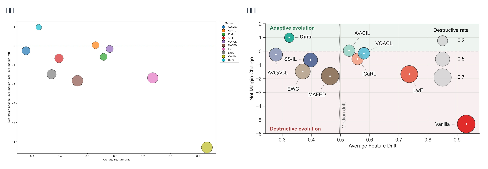
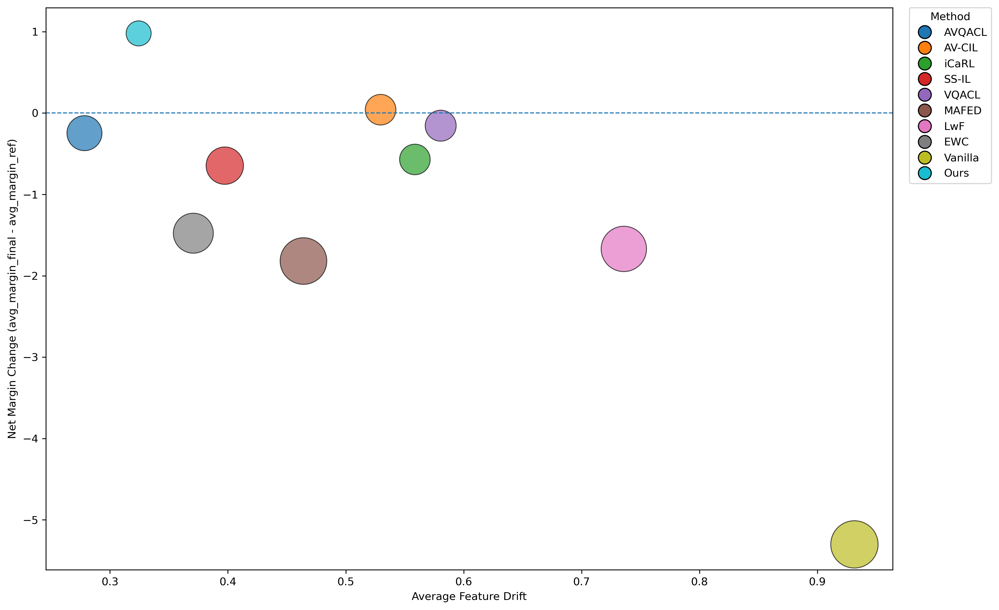
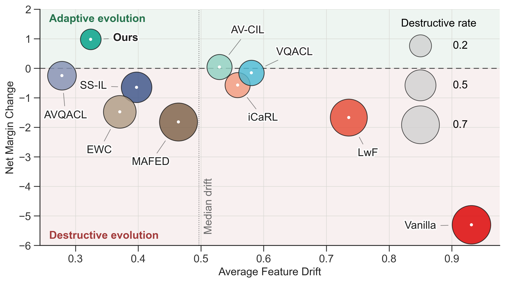

# 实验结果图：从默认气泡图到功能演化图

对应类型：**实验结果图**。

本案例讨论二维气泡图的润色。它用于同时展示不同方法的特征漂移、性能变化和破坏程度。原图已经包含核心数据，但更像默认绘图输出：留白过大、图例占据视觉重心、方法名称需要在图例和散点之间来回对应，读者很难快速判断哪些方法属于稳定演化，哪些方法属于破坏性变化。

润色后的版本把方法名称直接标到散点附近，用背景区域表达结论语义，并用气泡大小说明破坏程度，使读者可以更快读出图的核心判断。

<figure markdown>
  

  <figcaption>图 1. 功能演化图修改前后对比，润色版通过直接标注、语义背景和统一色系强化主要结论。</figcaption>
</figure>

## 文件说明

- [original.png](fig/original.png)：原始功能演化图
- [revised.png](fig/revised.png)：润色后的功能演化图
- [comparison.jpg](fig/comparison.jpg)：原图与润色后效果对比
- [original.py](code/original.py)：原始绘图代码
- [revised.py](code/revised.py)：润色后的绘图代码

## 案例背景

这张图比较多个方法在两个维度上的表现：

```text
横轴表示平均特征漂移；
纵轴表示边际变化；
气泡大小表示破坏程度；
散点位置用于判断方法处于适应演化还是破坏性变化区域。
```

图的核心任务不是单纯展示每个方法的坐标，而是让读者看出：哪些方法更接近理想区域，哪些方法虽然漂移较大却带来负向变化，本文方法是否处在更有利的位置。

## 原图

<figure markdown>
  

  <figcaption>图 2. 原始功能演化图，数据完整但视觉层级不清，读者需要依赖图例反复匹配方法和散点。</figcaption>
</figure>

## 原图问题

### 1. 图例承担了过多阅读任务

原图把方法名称集中放在右侧图例中，散点区域内没有直接标注。读者需要在图例和散点之间来回查找，尤其在气泡大小、颜色和位置都需要同时理解时，阅读负担较高。

### 2. 留白过大，数据区域不紧凑

原图中大量画布没有承载信息，关键散点分布在局部区域。过大的留白会降低数据密度，也会让读者难以快速聚焦主要比较关系。

### 3. 结论区域没有被显式表达

原图只有一条横向参考线，但没有说明不同象限或不同区域的含义。读者能看到坐标差异，却不容易立刻判断哪些区域代表适应性演化，哪些区域代表破坏性变化。

### 4. 色系和标签层级不够稳定

原图颜色较多，但颜色主要用于区分方法，没有和图的语义区域形成稳定关系。散点边框、图例、坐标轴和参考线也没有共同服务于一个清晰的视觉层级。

## 润色版

<figure markdown>
  

  <figcaption>图 3. 润色后的功能演化图，直接标注方法名称，并用背景色和参考线表达适应演化与破坏性变化。</figcaption>
</figure>

## 主要改进

1.  **把方法名称直接标到散点附近**  
    润色版减少对独立图例的依赖，读者可以直接在图中建立方法、位置和气泡大小之间的关系。

2.  **用背景区域表达结论语义**  
    上方区域表示更有利的变化，下方区域表示破坏性变化。背景色不是装饰，而是在帮助读者理解纵轴正负变化的含义。

3.  **压缩无效留白，突出主要分布**  
    润色版重新控制坐标范围和画布比例，使主要散点更集中，比较关系更容易被看见。

4.  **用气泡大小解释破坏程度**  
    气泡大小仍然保留，但通过右侧大小示意和更清楚的文本说明，让读者知道面积编码的含义。

5.  **统一色系和版式**  
    润色版使用更克制的色系、统一的网格和标签样式，让图看起来属于同一套论文视觉系统。

## 修改思路

这类二维气泡图可以按下面的顺序重构：

1.  先明确横轴、纵轴和气泡大小分别承担什么语义；
2.  删除不必要的外置图例，优先在散点附近直接标注方法；
3.  根据数据分布收紧坐标范围，避免大量无效留白；
4.  用背景区域或参考线说明不同象限的解释含义；
5.  控制颜色数量，让颜色服务于类别或结论语义；
6.  保留气泡大小示意，避免读者误解面积编码；
7.  统一字体、网格、边框、标签和参考线格式。

## 代码层面的修改

本案例的代码修改重点不是重新计算数据，而是重构图形表达。润色版代码见 [revised.py](code/revised.py)，原始代码见 [original.py](code/original.py)。

主要变化包括：

1.  **去掉外置图例依赖**  
    原图通过右侧图例解释方法颜色。润色版把方法名称直接标注在对应气泡附近，让读者不需要在图例和散点之间反复查找。

2.  **加入语义背景区域**  
    润色版用淡色背景区分适应演化和破坏性变化，并保留参考线，使坐标区域本身承担解释功能。

3.  **重新控制坐标范围和画布比例**  
    润色版收紧无效留白，让主要散点和参考区域占据更合理的视觉空间。

4.  **保留气泡大小示意**  
    气泡大小用于表达破坏程度。润色版保留大小示意，但把它从图例式类别解释转为更直接的面积编码说明。

5.  **统一字体、网格和边框样式**  
    润色版通过统一字体大小、网格颜色、边框粗细和标签样式，使图更接近论文主图，而不是默认散点图。

## 检查清单

画二维气泡图时，可以检查：

- [ ] 横轴、纵轴和气泡大小是否各自有明确含义？
- [ ] 读者是否能直接看出每个散点对应哪个方法？
- [ ] 是否避免让图例承担过多查找任务？
- [ ] 坐标范围是否过宽，是否存在大量无效留白？
- [ ] 参考线或背景区域是否说明了图中不同区域的含义？
- [ ] 气泡面积是否有解释，是否避免让大小编码变成装饰？
- [ ] 颜色是否与论文全文色系一致？
- [ ] 标注、网格、边框和字体是否统一？

## 经验总结

二维气泡图的难点在于同时编码位置、颜色和面积。润色的重点不是增加更多视觉元素，而是减少读者查找成本：让方法名称靠近散点，让背景区域承载结论语义，让坐标范围服务于主要比较关系。
