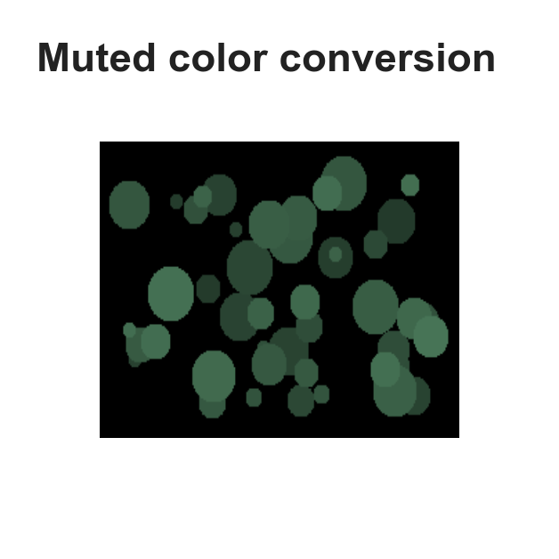
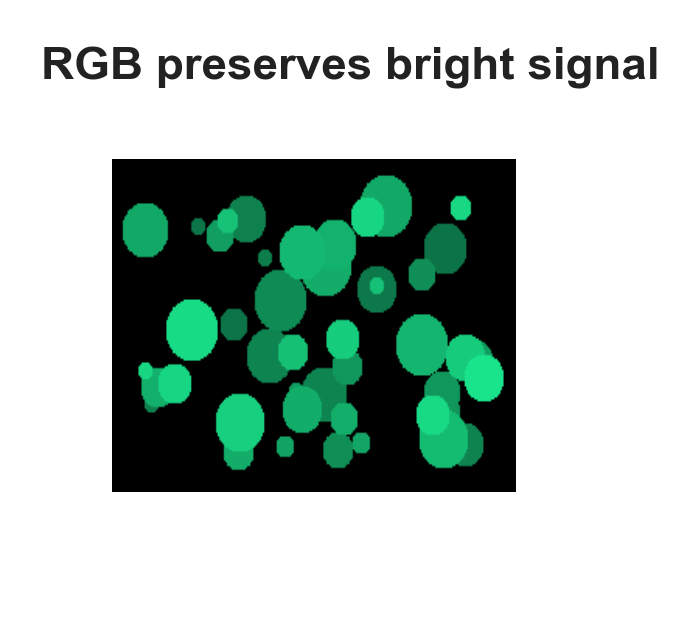
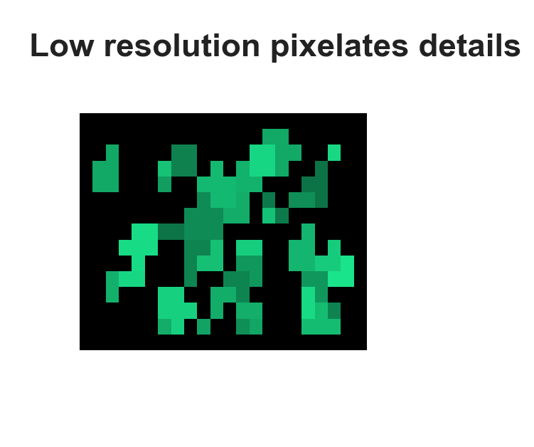
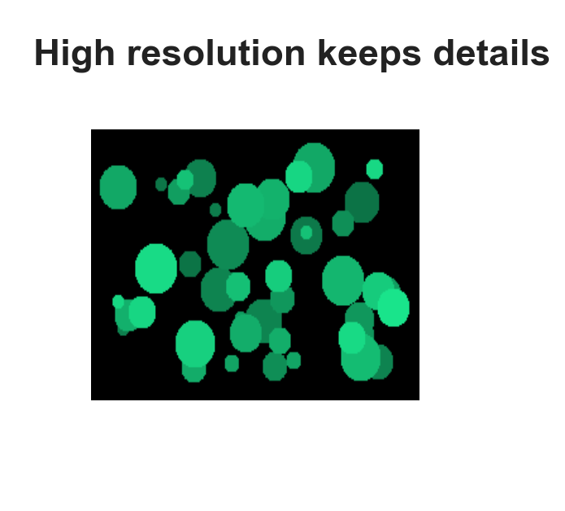
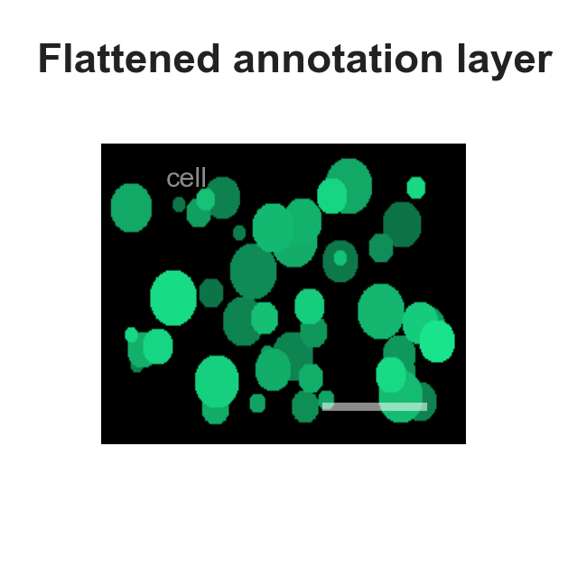
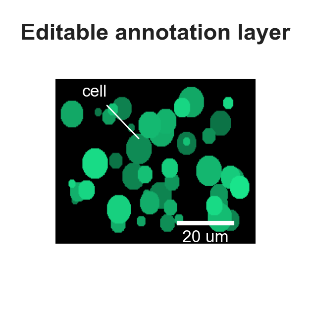

# 通用科研绘图 Checklist

科研图表不是简单地展示数据，而是服务于论文论证。画图前后，可以从以下几个方面进行检查。

## 1. 图的目的

- [ ] 这张图是否服务于一个明确的论文结论？
- [ ] 读者能否在几秒内看出主要信息？
- [ ] 这张图是否比表格更适合表达当前结果？
- [ ] 图中是否突出展示了最重要的对比或趋势？
- [ ] 正文是否解释了这张图如何支持论文观点？

## 2. 数据表达

- [ ] 是否完整展示了关键结果，而不是选择性展示？
- [ ] 坐标轴范围是否合理？
- [ ] 是否避免通过截断坐标轴夸大差异？
- [ ] 不同子图之间的坐标范围是否统一，或有清楚说明？
- [ ] 数值单位、评价指标和实验设置是否标注清楚？

## 3. 视觉设计

- [ ] 字体、字号、线宽是否统一？
- [ ] 图例是否清晰，且不遮挡数据？
- [ ] 坐标轴标题是否简洁明确？
- [ ] 子图编号如 `(a), (b), (c)` 是否格式统一？
- [ ] 是否去除了不必要的边框、网格和装饰元素？
- [ ] 图在缩小到论文单栏或双栏宽度后是否仍然可读？

## 4. 配色

- [ ] 颜色是否有明确含义？
- [ ] baseline 和 proposed method 是否区分清楚？
- [ ] 是否避免使用过多颜色？
- [ ] 同一方法在不同图中是否使用一致颜色？
- [ ] 是否考虑色盲友好性？
- [ ] 热力图或连续变量是否使用了合适的 colormap？

## 5. 投稿规范

- [ ] 是否保存为 PDF、SVG 或 EPS 等矢量格式？
- [ ] 是否同时保存高分辨率 PNG 用于预览和汇报？
- [ ] 是否避免截图式插图？
- [ ] 字体是否能够正确嵌入？
- [ ] LaTeX 插入后是否存在白边、模糊或字体过小问题？
- [ ] 图表文件命名是否清晰、可追踪？

### 5.1 图片类插图

显微图、照片、遥感图像、医学影像、可视化案例等以位图为主体的插图，还需要额外检查以下项目。Nature 图件规格中的示例可以转化为一个简单判断：**不要让图片、比例尺和文字在导出后变得不可编辑、不可读或失真**。

- [ ] 图片是否使用 RGB 色彩空间，而不是会削弱荧光或高饱和颜色表现的 CMYK？
- [ ] 位图主体是否来自足够高的原始分辨率，而不是在软件中强行放大？
- [ ] 照片或显微图是否至少满足 300 dpi；用于最终提交时是否尽量达到期刊要求的更高分辨率？
- [ ] 局部放大图、样例图或纹理细节在论文实际尺寸下是否没有像素化、发虚或压缩伪影？
- [ ] 显微图、医学图像等是否使用比例尺，而不是只写放大倍数？
- [ ] 比例尺、箭头、框线和文字是否保留为单独的可编辑矢量元素，而不是压平成图片背景？
- [ ] 图片上的文字是否避开复杂背景；必要时是否使用引线、标注框或留白区域提高可读性？
- [ ] 导出时是否保留文字、线条、比例尺和标注的可编辑性，并嵌入标准字体？
- [ ] 是否避免把低分辨率截图、网页截图或压缩图片作为正式投稿图？

#### Nature 图片示例

以下示例来自 [Nature Research Figure Guide: Preparing figures - our specifications](https://research-figure-guide.nature.com/figures/preparing-figures-our-specifications/)，用于说明图片类插图中常见的错误和推荐做法。

!!! note "示例图来源说明"

    本节规范参考 Nature Research Figure Guide，但页面内图片已改为本站自绘示意图，用于教学说明和复现规范原则。引用 Nature 时应链接其原页面作为规范来源，避免直接复用原图。

<figure markdown>
  

  <figcaption><strong>避免：</strong>使用 CMYK 色彩空间提交图片，荧光和高饱和颜色容易显得暗淡。</figcaption>
</figure>

<figure markdown>
  

  <figcaption><strong>推荐：</strong>使用 RGB 色彩空间，更适合保留数字阅读中的颜色表现。</figcaption>
</figure>

<figure markdown>
  

  <figcaption><strong>避免：</strong>低分辨率图片在打印或缩放后出现像素化、发虚和细节缺失。</figcaption>
</figure>

<figure markdown>
  

  <figcaption><strong>推荐：</strong>使用原始细节充足的高分辨率图片，照片类图片至少满足 300 dpi。</figcaption>
</figure>

<figure markdown>
  

  <figcaption><strong>避免：</strong>把比例尺和标签压平成图片像素，导致标注发虚、尺寸不稳定、后期不可编辑。</figcaption>
</figure>

<figure markdown>
  

  <figcaption><strong>推荐：</strong>比例尺和文字保留为单独的可编辑图层或矢量元素，导出后仍然清晰。</figcaption>
</figure>

## 6. Caption 与正文

- [ ] caption 是否说明了图展示的内容？
- [ ] caption 是否总结了核心发现？
- [ ] caption 是否避免过于笼统，例如只写 “Comparison of different methods”？
- [ ] 正文是否引用并解释了该图？
- [ ] 图、caption 和正文分析是否一致？
- [ ] 读者是否能通过 caption 理解图的主要结论？

## 7. 最终检查

投稿前建议将图插入论文 PDF 后再次检查：

- [ ] 缩放后文字是否清楚？
- [ ] 颜色是否仍然容易区分？
- [ ] 图和正文引用是否对应？
- [ ] 图注是否完整？
- [ ] 图表编号是否正确？
- [ ] PDF 中是否存在字体缺失或显示异常？
