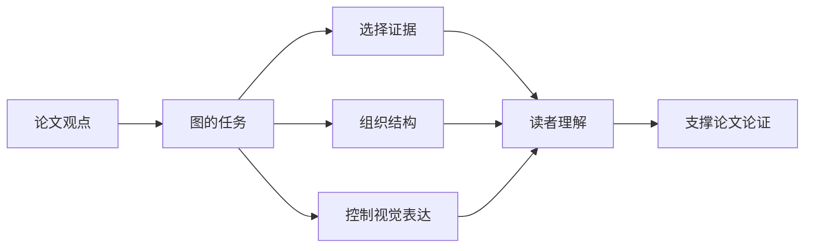

# 什么是好的科研图？

科研图不是简单地“把数据画出来”，而是将实验结果、方法设计和论文观点转化为可视化表达。本文中的“科研图”泛指论文中的各类插图，包括实验数据图、方法框架图、流程图、模块示意图、可视化案例图和对比展示图等。

!!! note "本节导学"

    读完这一节，你应该能够完成几件事。

    - 区分常见科研图类型，明确不同图的主要任务；
    - 判断一张图是否真正服务于论文观点；
    - 用“结论、证据、表达、规范”四个维度检查自己的图；
    - 避免把“好看”误认为“好图”。

## 1. 科研图的本质

科研图的核心任务是 **降低读者理解论文的成本**。一张图应该把正文中的关键逻辑变成可见结构，让读者更快看到问题、证据和结论之间的关系。

因此，科研图不是论文之外的装饰，而是论文论证的一部分。画图前可以先问三个问题。

- **这张图想说明什么？**
- **图中的证据是否支持这个判断？**
- **读者能否快速读出主要信息？**

## 2. 科研图的常见类型

不同类型的科研图承担不同任务。画图前先判断图的类型，能避免把“示意图”“结果图”和“证据图”混在一起。

### 2.1 方法框架图

方法框架图用于展示模型结构、训练流程、模块关系和输入输出逻辑。它的核心目标是帮助读者快速理解方法是如何工作的。

<figure markdown>
  

  <figcaption>图 1. <a href="https://arxiv.org/abs/2510.06842">MAGR++ 方法框架图</a>。展示模型模块、信息流和输入输出关系。</figcaption>
</figure>

<figure markdown>
  

  <figcaption>图 2. <a href="https://openreview.net/pdf?id=k5PgSlNc4E">PACE 方法框架图</a>。通过模块结构说明方法的整体流程。</figcaption>
</figure>

<figure markdown>
  

  <figcaption>图 3. <a href="https://openreview.net/pdf?id=8pi1rP71qv">FlyPrompt 方法框架图</a>。展示输入、提示机制和预测模块之间的关系。</figcaption>
</figure>

常见问题是模块太多、箭头混乱、主流程和辅助模块没有区分、颜色没有语义。

### 2.2 流程图和示意图

流程图和示意图通常用于解释任务设定、数据处理流程、问题动机或核心思想。它们不一定展示真实实验数据，但需要清楚表达概念关系。

<figure markdown>
  

  <figcaption>图 4. <a href="https://arxiv.org/pdf/2606.13022">质量攻击方法示意图</a>。通过流程对比说明新方法与已有攻击方法的差异。</figcaption>
</figure>

<figure markdown>
  

  <figcaption>图 5. <a href="https://arxiv.org/abs/2510.06842">MAGR++ 研究动机示意图</a>。通过真实场景和任务差异引出方法需要解决的问题。</figcaption>
</figure>

<figure markdown>
  

  <figcaption>图 6. <a href="https://openreview.net/pdf?id=k5PgSlNc4E">PACE 研究动机示意图</a>。用应用场景和限制条件说明任务设定。</figcaption>
</figure>

<figure markdown>
  

  <figcaption>图 7. <a href="https://arxiv.org/pdf/2502.19644E">CVQA 应用场景示意图。</a>展示虚拟现实视频质量评价中的用户场景、内容变化和设备约束。</figcaption>
</figure>

常见问题是概念过多、层级不清、图中文字太长、示意元素和论文表述不一致。

### 2.3 实验结果图

实验结果图用于展示定量结果，例如柱状图、折线图、热力图、散点图、箱线图等。它的核心目标是突出实验现象和方法优势。

<figure markdown>
  

  <figcaption>图 8. <a href="https://openreview.net/pdf?id=8pi1rP71qv">FlyPrompt 实验结果图</a>。用于展示不同方法或设置之间的定量差异。</figcaption>
</figure>

<figure markdown>
  

  <figcaption>图 9. <a href="https://openreview.net/pdf?id=k5PgSlNc4E">PACE 实验结果图</a>。通过结果对比突出方法表现。</figcaption>
</figure>

常见问题是只展示数字、不突出结论、坐标轴范围不合理、配色混乱。

### 2.4 消融分析图

消融分析图用于说明不同模块、损失函数、超参数或设计选择的贡献。它需要清楚回答“哪个设计有效，为什么有效”。

<figure markdown>
  

  <figcaption>图 10. <a href="https://openreview.net/pdf?id=k5PgSlNc4E">PACE 消融对比图</a>。用于说明不同模块或设置对结果的贡献。</figcaption>
</figure>

<figure markdown>
  

  <figcaption>图 11. <a href="https://arxiv.org/pdf/2602.19170">BriMA 消融对比图</a>。直观展示检索增强策略相对于传统策略的有效性。</figcaption>
</figure>

常见问题是缺少基线方法、变量控制不清、不同设置之间不可比较。

### 2.5 可视化案例图

可视化案例图用于展示预测结果、重建结果、注意力图、失败案例或定性比较。它可以增强直观性，但需要避免只挑选“最好看”的样例。

<figure markdown>
  

  <figcaption>图 12. <a href="https://arxiv.org/pdf/2510.06842">MAGR++ 案例分析图</a>。通过具体样例展示方法输出或错误模式。</figcaption>
</figure>

<figure markdown>
  

  <figcaption>图 13. <a href="https://arxiv.org/pdf/2511.03992">CaRF 案例分析图</a>。用于呈现定性结果和样例级差异。</figcaption>
</figure>

<figure markdown>
  

  <figcaption>图 14. <a href="https://arxiv.org/pdf/2511.03992">GeoCGA 案例分析图</a>。用于展示可视化案例和局部现象。</figcaption>
</figure>

常见问题是案例选择不公平、没有说明成功或失败原因、样例过少或排版过挤。

## 3. 好图的判断标准

主观感觉“好看”不是充分标准。科研图首先要服务于论文论证，其次才是视觉风格。

### 3.1 结论明确

一张图应该服务于一个清晰的论文观点。读者看完后应该知道这张图想说明什么，而不是只看到一组元素、颜色或数值。

这个判断来自科研论文对图件的基本定位。Nature 科研图指南[^nature-guide]把图视为论文的核心组成部分，并强调编辑良好的图可以提高理解效率。信息确定以后，图的结构、标注和视觉层级才有判断依据。因此，检查一张图时可以先问一句话，**它支撑的是论文中的哪一个结论**。

### 3.2 信息清晰

图中的主趋势、关键对比和主要结论应该容易识别。不要让读者在过多颜色、文字、箭头和图例中寻找重点。

清晰不是把信息删少，而是让信息有层级。Nature 图件规格[^nature-preparing]要求数据图包含坐标轴、刻度、单位和可读文字，同时避免多余装饰、重叠文字和难读背景。实际检查时，先看标题、坐标轴、图例和高亮元素是否共同指向同一个重点。

### 3.3 视觉统一

同一篇论文中的字体、字号、线宽、颜色、图例、子图编号和排版风格应该尽量一致。统一不是为了形式整齐，而是为了降低读者在不同图之间切换的认知成本。

期刊规范也会把统一性写得很具体。Nature 终稿说明[^nature-final]建议图中文字使用无衬线字体，并在整篇论文的所有图中保持一致；Nature 科研图规格[^nature-preparing]进一步要求使用标准字体，并给出子图标注、字号和字体嵌入要求。由此可以得到一个实用标准，**同一篇论文不要让字体、字号、颜色规则和子图标注各自为政**。

### 3.4 表达准确

图不能通过不合理的坐标轴范围、选择性展示或夸张配色误导读者。美观不能牺牲准确性。

这一点直接关系到科研表达的可信度。Cleveland 和 McGill 的图形感知研究[^cleveland1984]说明，不同视觉编码会影响读者提取数量信息的准确性；Nature 图像完整性说明[^nature-integrity]也要求最终图像正确代表原始数据。检查数据图时，不只看图是否漂亮，还要看坐标轴、刻度、误差线、归一化方式和样例选择是否让读者得到与数据一致的结论。

### 3.5 可读可复现

图在缩小到论文单栏或双栏宽度后仍应清晰可读。对于数据图，代码、数据和输出结果应尽量可复现。

可读性有明确的投稿约束。Nature 图件排版说明[^nature-export]给出了单栏和双栏图宽，并要求缩小后文字仍然清楚、可编辑；Nature 图件规格[^nature-preparing]还给出了分辨率、字体嵌入和矢量导出的要求。可复现性则来自工具链控制，例如 Matplotlib 字体文档[^matplotlib-fonts]说明了导出时字体处理方式会影响后续编辑和跨平台显示。实际投稿前应同时检查两件事，**缩小后能不能读，换环境后能不能稳定导出**。

## 4. 常见误区

!!! warning "不要把“画得满”当成“信息充分”"

    科研图最常见的问题不是信息不够，而是信息没有层级。无关元素越多，读者越难判断什么才是重点。

常见误区主要有以下几类。

- 把所有实验结果都塞进一张图，导致主结论被稀释；
- 用太多颜色表达类别，但颜色本身没有明确语义；
- 只强调视觉效果，却没有突出数据证据；
- 图注只描述“画了什么”，没有说明“说明了什么”；
- 多个子图的字体、坐标轴、图例和颜色规则不一致。

## 5. 一句话总结

好的科研图不是“更好看”的图，而是能更清楚、更准确、更有说服力地表达论文观点的图。

[^nature-guide]: Nature Research Figure Guide. 该指南说明科研图是论文内容的重要组成部分，编辑良好的图可以提高理解效率并扩大研究传播范围。<https://research-figure-guide.nature.com/>

[^nature-preparing]: Nature Research Figure Guide. *Preparing figures - our specifications*. 该规范列出数据图必须包含的坐标轴、刻度、单位、可读文字，也列出应避免的多余装饰、重叠文字和难读背景。<https://research-figure-guide.nature.com/figures/preparing-figures-our-specifications/>

[^nature-final]: Nature. *Final submission*. 该说明建议图中文字使用无衬线字体，优先 Helvetica 或 Arial，并在所有图中保持一致。<https://www.nature.com/nature/for-authors/final-submission>

[^cleveland1984]: Cleveland, W. S., & McGill, R. (1984). *Graphical Perception: Theory, Experimentation, and Application to the Development of Graphical Methods*. Journal of the American Statistical Association. 这篇文章讨论了位置、长度、角度、面积、颜色等视觉编码在人类图形感知中的差异。<https://www.jstor.org/stable/2288400>

[^nature-integrity]: Nature Research Figure Guide. *Image Integrity*. 该说明要求最终图像正确代表原始数据，并避免会遮蔽或改变数据含义的处理。<https://research-figure-guide.nature.com/figures/image-integrity/>

[^nature-export]: Nature Research Figure Guide. *Building and Exporting Figure Panels*. 该说明给出单栏和双栏图宽，并要求图中文字保持清楚、可编辑。<https://research-figure-guide.nature.com/figures/building-and-exporting-figure-panels/>

[^matplotlib-fonts]: Matplotlib. *Fonts in Matplotlib*. 该文档说明 Matplotlib 在 PDF 和 PostScript 中的字体处理方式，相关设置会影响后续编辑和跨平台显示。<https://matplotlib.org/stable/users/explain/text/fonts.html>
