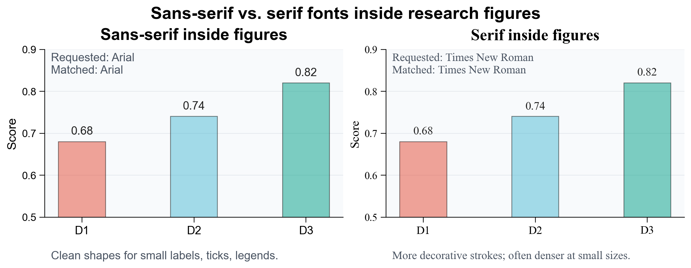

# 字体配置

科研图中的字体主要服务于三件事：**缩小后清楚、导出后不被替换、与正文和公式风格一致**。这里讨论的是投稿阶段的图件规范；不同出版物在接收后可能会按照自己的生产流程进一步调整字体和版式。

投稿时先把图中文字处理清楚，核心目的是提高审稿阶段 PDF 的可读性，减少字体混乱、字号过小或导出替换带来的理解成本。

## 1. 基本原则

- **统一**：同一篇论文中的图尽量使用同一种字体。
- **可读**：缩小到单栏或双栏宽度后仍然清楚。
- **标准**：优先使用常见字体，避免装饰性字体。
- **可嵌入**：导出 PDF / SVG / EPS 时避免字体被替换。
- **公式一致**：数学符号尽量与 LaTeX 公式风格一致。

## 2. 为什么用无衬线字体

图内文字通常很小，尤其是坐标轴数字、图例、子图编号和局部标注。**无衬线字体更适合这些小尺寸信息**，因为字形结构更简洁，缩小后更容易辨认。

- **无衬线字体**：没有额外装饰笔画，例如 Arial、Helvetica、DejaVu Sans。适合图内坐标轴、图例和短标签。
- **有衬线字体**：笔画末端有小装饰，例如 Times New Roman。适合正文阅读，但放在图内小字号标注中容易显得更密。



## 3. 推荐字体

图内普通英文标注推荐使用无衬线字体：

```text
Arial
Helvetica
DejaVu Sans
Liberation Sans
Calibri
```

投稿阶段最稳妥的选择是：

```text
Arial / Helvetica
```

数学符号和公式推荐使用：

```text
Latin Modern Math
LaTeX math
Symbol
```

中文标注可使用：

```text
Noto Sans CJK SC
Microsoft YaHei
SimHei
```

简要组合：

```text
英文标注：Arial / Helvetica
数学公式：Latin Modern Math / LaTeX math
中文标注：Noto Sans CJK SC
```

## 4. 参考规范

一些期刊和工具文档对图中文字有明确建议：

- Nature 建议图中文字使用无衬线字体，优先 Helvetica 或 Arial，并在同一篇论文的所有图中保持一致。
- PLOS ONE 要求图中文字使用 Arial、Times 或 Symbol，字号为 8-12 pt。
- Matplotlib 支持 PDF / PS 字体嵌入，合理设置字体类型有助于后续编辑和投稿。
- Latin Modern Math 是接近 LaTeX 数学风格的 OpenType 数学字体。

参考链接：

- [Nature final submission](https://www.nature.com/nature/for-authors/final-submission)
- [Nature initial submission](https://www.nature.com/nature/for-authors/initial-submission)
- [PLOS ONE figure guidelines](https://journals.plos.org/plosone/s/figures)
- [Matplotlib font documentation](https://matplotlib.org/stable/users/explain/text/fonts.html)
- [CTAN Latin Modern Math](https://ctan.org/pkg/lm-math)
- [CTAN Latin Modern](https://ctan.org/pkg/lm)

## 5. 检查字体匹配

不要只看代码里写了什么字体，还要检查系统实际匹配到了哪个字体：

```bash
fc-match Arial
fc-match Helvetica
fc-match "Latin Modern Math"
fc-match "Noto Sans CJK SC"
```

生成字体对比图的脚本见 [visualize_font_comparison.py](code/visualize_font_comparison.py)。

## 6. Linux 安装 Arial

Ubuntu / Debian 可通过 Microsoft Core Fonts 安装 Arial：

```bash
sudo apt update
sudo apt install ttf-mscorefonts-installer
sudo fc-cache -f -v
```

如果提示找不到该包，先启用 `multiverse`：

```bash
sudo add-apt-repository multiverse
sudo apt update
sudo apt install ttf-mscorefonts-installer
sudo fc-cache -f -v
```

检查：

```bash
fc-match Arial
```

相关链接：

- [Ubuntu ttf-mscorefonts-installer](https://www.ubuntuupdates.org/package/core/noble/multiverse/base/ttf-mscorefonts-installer)

## 7. 安装 Latin Modern Math

### Linux

Ubuntu / Debian 可安装 Latin Modern 字体包：

```bash
sudo apt update
sudo apt install fonts-lmodern
sudo fc-cache -f -v
```

检查：

```bash
fc-match "Latin Modern Math"
```

### Windows

Windows 可以从 CTAN 下载 Latin Modern Math 字体文件：

- [Latin Modern Math](https://ctan.org/pkg/lm-math)
- [Latin Modern](https://ctan.org/pkg/lm)

下载后解压，找到 `.otf` 或 `.ttf` 字体文件，右键选择 **Install** 或 **Install for all users**。如果已经打开 PowerPoint、Word 或 Illustrator，安装后建议重启这些软件，让它们重新加载字体列表。

在 PowerPoint 中检查时，可以插入一个公式，选中公式内容，在数学字体列表中查找 `Latin Modern Math`。

### 手动安装

也可以从 CTAN 手动下载：

- [Latin Modern Math](https://ctan.org/pkg/lm-math)
- [Latin Modern](https://ctan.org/pkg/lm)

Linux 下也可以手动安装到用户字体目录：

```bash
mkdir -p ~/.local/share/fonts
cp *.otf ~/.local/share/fonts/
fc-cache -f -v
```

## 8. Matplotlib 推荐配置

英文论文图推荐：

```python
import matplotlib.pyplot as plt

plt.rcParams.update(
    {
        "font.family": "Arial",
        "font.sans-serif": ["Arial", "Helvetica", "DejaVu Sans"],
        "font.size": 8,
        "axes.labelsize": 8,
        "xtick.labelsize": 7,
        "ytick.labelsize": 7,
        "legend.fontsize": 7,
        "axes.titlesize": 8,
        "pdf.fonttype": 42,
        "ps.fonttype": 42,
    }
)
```

导出：

```python
plt.savefig("figure.pdf", bbox_inches="tight")
plt.savefig("figure.png", dpi=600, bbox_inches="tight")
```

其中：

- `pdf.fonttype = 42` 和 `ps.fonttype = 42` 有助于保留 TrueType 字体。
- PDF 适合论文投稿。
- PNG 适合预览和汇报。

## 9. 中文字体配置

如果图中包含中文，建议显式设置中文字体：

```python
import matplotlib.pyplot as plt

plt.rcParams.update(
    {
        "font.family": "sans-serif",
        "font.sans-serif": [
            "Arial",
            "Noto Sans CJK SC",
            "Microsoft YaHei",
            "SimHei",
            "DejaVu Sans",
        ],
        "axes.unicode_minus": False,
        "pdf.fonttype": 42,
        "ps.fonttype": 42,
    }
)
```

Linux 安装 Noto CJK：

```bash
sudo apt update
sudo apt install fonts-noto-cjk
sudo fc-cache -f -v
```

检查：

```bash
fc-match "Noto Sans CJK SC"
```

## 10. PowerPoint 公式字体

如果用 PowerPoint 绘制示意图或编辑公式，可以使用：

```text
普通文字：Arial / Helvetica
数学公式：Latin Modern Math
```

如果 PowerPoint 中找不到 `Latin Modern Math`，通常是字体未安装或软件尚未重新加载字体。安装后建议重启 PowerPoint。

## 11. 最终检查

投稿前建议检查：

- [ ] 图内字体是否统一。
- [ ] 缩小后是否仍然可读。
- [ ] 是否避免装饰性字体。
- [ ] PDF / SVG / EPS 中字体是否正确嵌入。
- [ ] 数学符号是否与正文公式风格一致。
- [ ] 是否用 `fc-match` 检查实际字体匹配。
- [ ] 是否避免将文字截图成位图。

## 12. 简要建议

不确定怎么选时，可以直接使用：

```text
英文标注：Arial / Helvetica
数学公式：Latin Modern Math / LaTeX math
中文标注：Noto Sans CJK SC
导出格式：PDF + 600 dpi PNG
Matplotlib：pdf.fonttype = 42, ps.fonttype = 42
```
