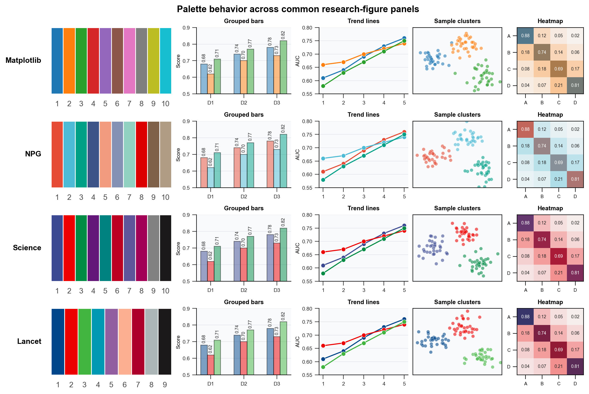

# 科研图配色方案

本目录整理适合论文图、汇报图和多子图科研图的常用配色。NPG、Science、Lancet 指的是对应期刊常见视觉风格的配色方案，**不是投稿强制标准**；Matplotlib 默认配色只作为 Python 绘图的基线参照。

本站点的 **默认推荐配色方案是 NPG**。如果没有特殊领域或期刊风格要求，优先从 NPG 开始，再根据图的语义和可读性微调。

实际使用时，优先级应是：**可读性 > 语义一致 > 风格接近**。如果颜色在缩小后的论文 PDF 中难以区分，就不应只因为它“像某个期刊风格”而继续使用。

## 1. 使用原则

- **同一篇论文中尽量固定一套主配色。** 同一种方法、同一种数据集或同一种语义，在不同图中应尽量保持同色。
- **颜色要承担语义，而不是只做装饰。** 例如 baseline、proposed method、risk、gain 这类概念应有稳定映射。
- **类别少时优先使用高区分度颜色；类别多时降低饱和度。** 类别过多时，不要试图让每个颜色都很抢眼。
- **柱状图、面积图、背景散点可以使用半透明色。** 这样能降低视觉压力，也方便多个元素共存。
- **文字、坐标轴和误差线不要使用过浅颜色。** 这些元素承担读数功能，应优先保证清楚。

## 2. 不同子图形态示例

下面把 Python 默认配色和三套期刊风格配色放到常见科研图子图中对比。**选择配色时不要只看单个色块**，还要检查它在目标图形形态中的可读性。

图中包含几类常见形态：色条用于检查颜色区分度，柱状图适合方法或设置对比，折线图适合趋势变化，散点图适合样本分布，热力图适合矩阵或混淆结果。

<figure markdown>
  

  <figcaption>图 1. NPG、Science、Lancet 和 Matplotlib 默认配色在常见科研图子图中的效果对比。</figcaption>
</figure>

生成脚本见 [visualize_palette_panels.py](code/visualize_palette_panels.py)。如果论文中只包含两到三类方法，**优先使用每套配色的前 3-4 个高区分度颜色**；如果是多子图科研图，**同一方法或同一语义在所有子图中应保持同色**。

## 3. Matplotlib 默认风格

Matplotlib 默认颜色循环来自 Tableau / `tab10` 风格。**它适合快速探索和草图，不一定适合直接作为论文最终配色。**

它的优点是开箱即用、区分度较高；缺点是默认橙、绿、红、紫等颜色在正式论文中可能显得较强，且不同论文中容易出现 Python 默认图的视觉痕迹。

### 十六进制颜色

```python
MATPLOTLIB_HEX = [
    "#1F77B4",  # 蓝色
    "#FF7F0E",  # 橙色
    "#2CA02C",  # 绿色
    "#D62728",  # 红色
    "#9467BD",  # 紫色
    "#8C564B",  # 棕色
    "#E377C2",  # 粉色
    "#7F7F7F",  # 灰色
    "#BCBD22",  # 橄榄色
    "#17BECF",  # 青色
]
```

### Matplotlib 当前环境读取方式

```python
import matplotlib.pyplot as plt

MATPLOTLIB_DEFAULT = plt.rcParams["axes.prop_cycle"].by_key()["color"]
```

## 4. NPG 风格

NPG 风格适合大多数机器学习、生物医学和综合科研图。**本站点默认推荐使用这套配色作为通用论文配色。**

这套配色的蓝、青、绿、红区分明显，适合多方法对比和多子图科研图；如果图中已经有大量文字或标注，可以适当降低填充透明度。

### 十六进制颜色

```python
NPG_HEX = [
    "#E64B35",  # 朱红色
    "#4DBBD5",  # 青蓝色
    "#00A087",  # 绿色
    "#3C5488",  # 深蓝色
    "#F39B7F",  # 鲑红色
    "#8491B4",  # 灰紫蓝色
    "#91D1C2",  # 薄荷绿色
    "#DC0000",  # 强红色
    "#7E6148",  # 棕色
    "#B09C85",  # 灰褐色
]
```

### RGB

```python
NPG_RGB = [
    (230, 75, 53),
    (77, 187, 213),
    (0, 160, 135),
    (60, 84, 136),
    (243, 155, 127),
    (132, 145, 180),
    (145, 209, 194),
    (220, 0, 0),
    (126, 97, 72),
    (176, 156, 133),
]
```

### Matplotlib 半透明写法

```python
from matplotlib.colors import to_rgba

NPG_RGBA_032 = [to_rgba(color, alpha=0.32) for color in NPG_HEX]
NPG_RGBA_060 = [to_rgba(color, alpha=0.60) for color in NPG_HEX]
```

常用语义映射：

```python
NPG_SEMANTIC = {
    "risk": to_rgba("#E64B35", alpha=0.32),
    "baseline": to_rgba("#3C5488", alpha=0.32),
    "method": to_rgba("#4DBBD5", alpha=0.32),
    "improvement": to_rgba("#00A087", alpha=0.45),
    "background": to_rgba("#D0D0D0", alpha=0.32),
    "text": "#1A1A1A",
    "grid": "#E6E6E6",
}
```

## 5. Science 风格

Science 风格适合对比强、结论明确的结果图。**当图的重点是突出主要差异时，可以优先考虑这套配色。**

它的深蓝、正红、绿色和紫色对比强，适合方法比较、分类结果和关键实验组；但如果同一张图中类别很多，需要注意避免颜色过于拥挤。

### 十六进制颜色

```python
SCIENCE_HEX = [
    "#3B4992",  # 深蓝色
    "#EE0000",  # 红色
    "#008B45",  # 绿色
    "#631879",  # 紫色
    "#008280",  # 蓝绿色
    "#BB0021",  # 深红色
    "#5F559B",  # 紫蓝色
    "#A20056",  # 洋红色
    "#808180",  # 灰色
    "#1B1919",  # 近黑色
]
```

### RGB

```python
SCIENCE_RGB = [
    (59, 73, 146),
    (238, 0, 0),
    (0, 139, 69),
    (99, 24, 121),
    (0, 130, 128),
    (187, 0, 33),
    (95, 85, 155),
    (162, 0, 86),
    (128, 129, 128),
    (27, 25, 25),
]
```

### Matplotlib 半透明写法

```python
from matplotlib.colors import to_rgba

SCIENCE_RGBA_032 = [to_rgba(color, alpha=0.32) for color in SCIENCE_HEX]
SCIENCE_RGBA_060 = [to_rgba(color, alpha=0.60) for color in SCIENCE_HEX]
```

常用语义映射：

```python
SCIENCE_SEMANTIC = {
    "control": to_rgba("#3B4992", alpha=0.32),
    "treatment": to_rgba("#EE0000", alpha=0.32),
    "secondary": to_rgba("#008B45", alpha=0.32),
    "ablation": to_rgba("#631879", alpha=0.32),
    "background": to_rgba("#808180", alpha=0.24),
    "text": "#1B1919",
    "grid": "#E6E6E6",
}
```

## 6. Lancet 风格

Lancet 风格适合医学、生物医学和临床实验结果图。**如果图中包含实验组对照、临床队列或医学任务结果，这套配色通常比较稳妥。**

这里采用常见的 Lancet Oncology 色组，也就是 `ggsci::pal_lancet("lanonc")` 对应的配色。整体对比强、主色偏稳重，适合方法对比、实验组对照和多子图结果图。

### 十六进制颜色

```python
LANCET_HEX = [
    "#00468B",  # 深蓝色
    "#ED0000",  # 红色
    "#42B540",  # 绿色
    "#0099B4",  # 青色
    "#925E9F",  # 紫色
    "#FDAF91",  # 浅鲑红色
    "#AD002A",  # 深红色
    "#ADB6B6",  # 灰青色
    "#1B1919",  # 近黑色
]
```

### RGB

```python
LANCET_RGB = [
    (0, 70, 139),
    (237, 0, 0),
    (66, 181, 64),
    (0, 153, 180),
    (146, 94, 159),
    (253, 175, 145),
    (173, 0, 42),
    (173, 182, 182),
    (27, 25, 25),
]
```

### Matplotlib 半透明写法

```python
from matplotlib.colors import to_rgba

LANCET_RGBA_032 = [to_rgba(color, alpha=0.32) for color in LANCET_HEX]
LANCET_RGBA_060 = [to_rgba(color, alpha=0.60) for color in LANCET_HEX]
```

常用语义映射：

```python
LANCET_SEMANTIC = {
    "baseline": to_rgba("#00468B", alpha=0.32),
    "proposed": to_rgba("#ED0000", alpha=0.32),
    "secondary": to_rgba("#42B540", alpha=0.32),
    "cohort": to_rgba("#0099B4", alpha=0.32),
    "background": to_rgba("#ADB6B6", alpha=0.24),
    "text": "#1A1A1A",
    "grid": "#E6E6E6",
}
```

## 7. 快速复制模板

如果只需要在一张图里使用半透明期刊风格颜色，可以直接复制下面这段：

```python
from matplotlib.colors import to_rgba

NPG = {
    "red": "#E64B35",
    "cyan": "#4DBBD5",
    "green": "#00A087",
    "blue": "#3C5488",
    "gray": "#D0D0D0",
}

COLORS = {
    "main": to_rgba(NPG["blue"], alpha=0.32),
    "compare": to_rgba(NPG["cyan"], alpha=0.32),
    "gain": to_rgba(NPG["red"], alpha=0.32),
    "highlight": to_rgba(NPG["green"], alpha=0.60),
    "background": to_rgba(NPG["gray"], alpha=0.24),
    "text": "#1A1A1A",
    "grid": "#E6E6E6",
}
```

## 8. 透明度建议

| 场景 | 推荐透明度 |
| --- | --- |
| 主柱状图填充 | `0.32` - `0.45` |
| 散点主类别 | `0.55` - `0.75` |
| 背景散点 | `0.18` - `0.32` |
| 内嵌小图或辅助区域 | `0.24` - `0.45` |
| 高亮边框、文字、误差线 | 不建议透明 |

注意：**透明色适合降低视觉压力，但不适合用于细线、文字和误差线。** 导出 PDF 时也要检查透明叠加是否符合期刊投稿系统要求。

## 9. 参考资料

Matplotlib 默认颜色循环[^matplotlib-cycle]适合快速探索，正式论文图应根据数据类型和投稿风格重新检查颜色循环。Matplotlib 颜色循环文档[^matplotlib-cycler]说明了如何在 `rcParams` 或单个坐标轴中设置颜色循环。

连续变量推荐使用感知均匀的 colormap，例如 `viridis` 或 `cividis`，避免因为颜色亮度变化不均而制造虚假的视觉边界。

Lancet 风格配色可以参考 ggsci 的实现[^ggsci-lancet]，更多期刊风格配色可参考科研绘图配色集合[^bioinfo-colors]。

*[colormap]: 将数值映射为颜色的规则，常用于 heatmap、attention map 和 density map。

[^matplotlib-cycle]: Matplotlib. *Colors in the default property cycle*. 该示例展示 Matplotlib 默认颜色循环的来源和显示效果。<https://matplotlib.org/stable/gallery/color/color_cycle_default.html>

[^matplotlib-cycler]: Matplotlib. *Styling with cycler*. 该文档说明如何在 `rcParams` 或单个 `Axes` 中设置颜色循环。<https://matplotlib.org/stable/users/explain/artists/color_cycle.html>

[^ggsci-lancet]: ggsci. *Lancet journal color palettes*. 该页面说明 Lancet 和 Lancet Oncology 风格配色。<https://nanx.me/ggsci/reference/pal_lancet.html>

[^bioinfo-colors]: 微生信. *常见期刊配色，SCI 论文配色*. 该页面整理了常见期刊风格和科研绘图配色。<https://bioinformatics.com.cn/static/others/colorsets/colors.html>
